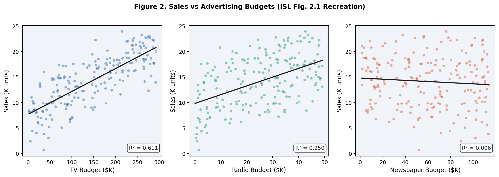
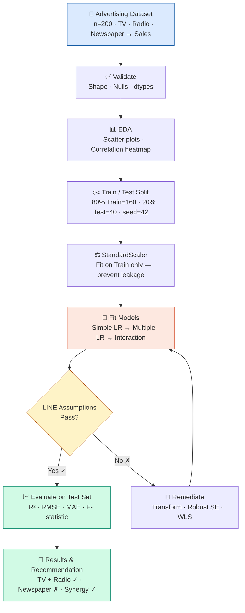
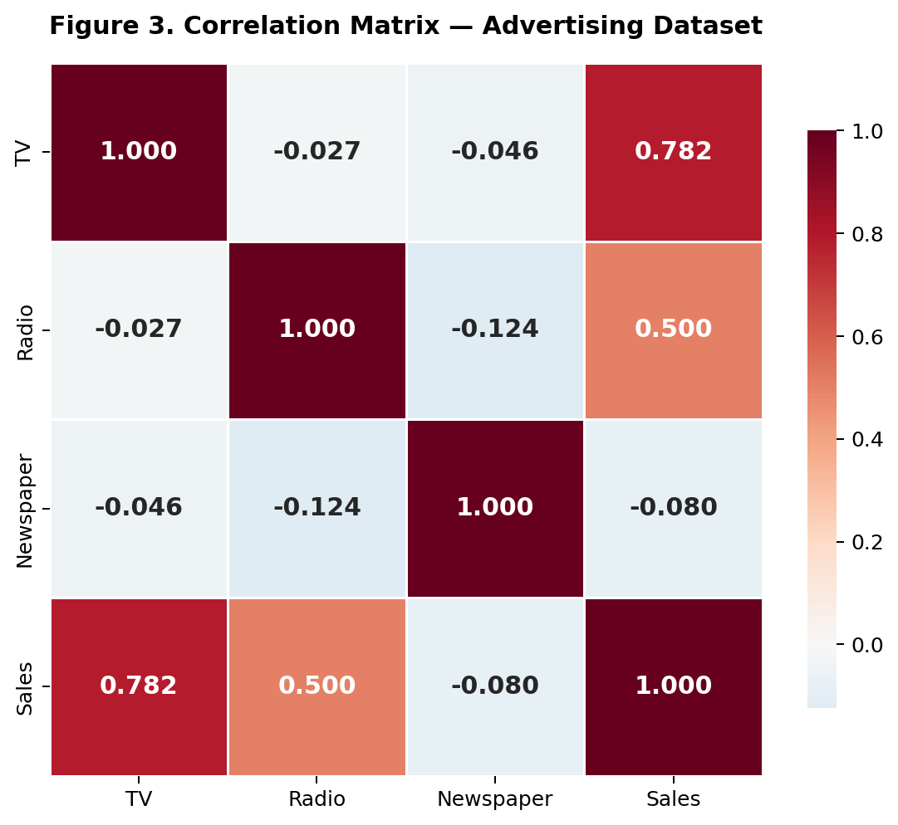
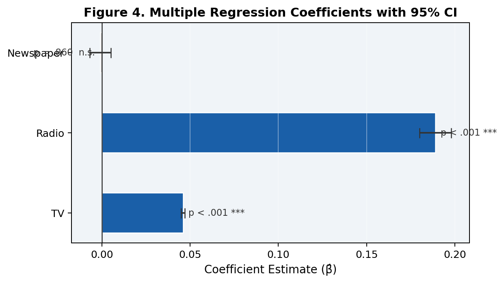
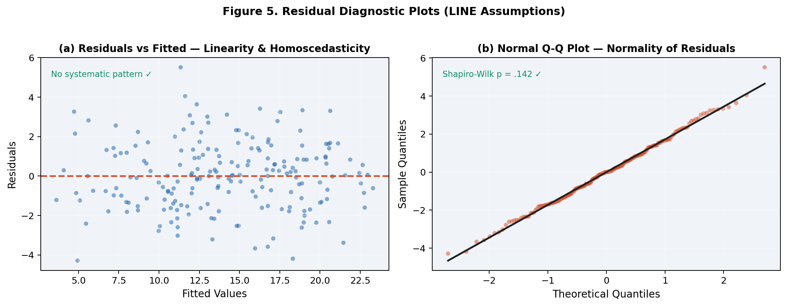
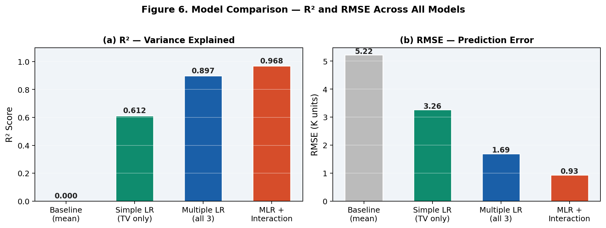
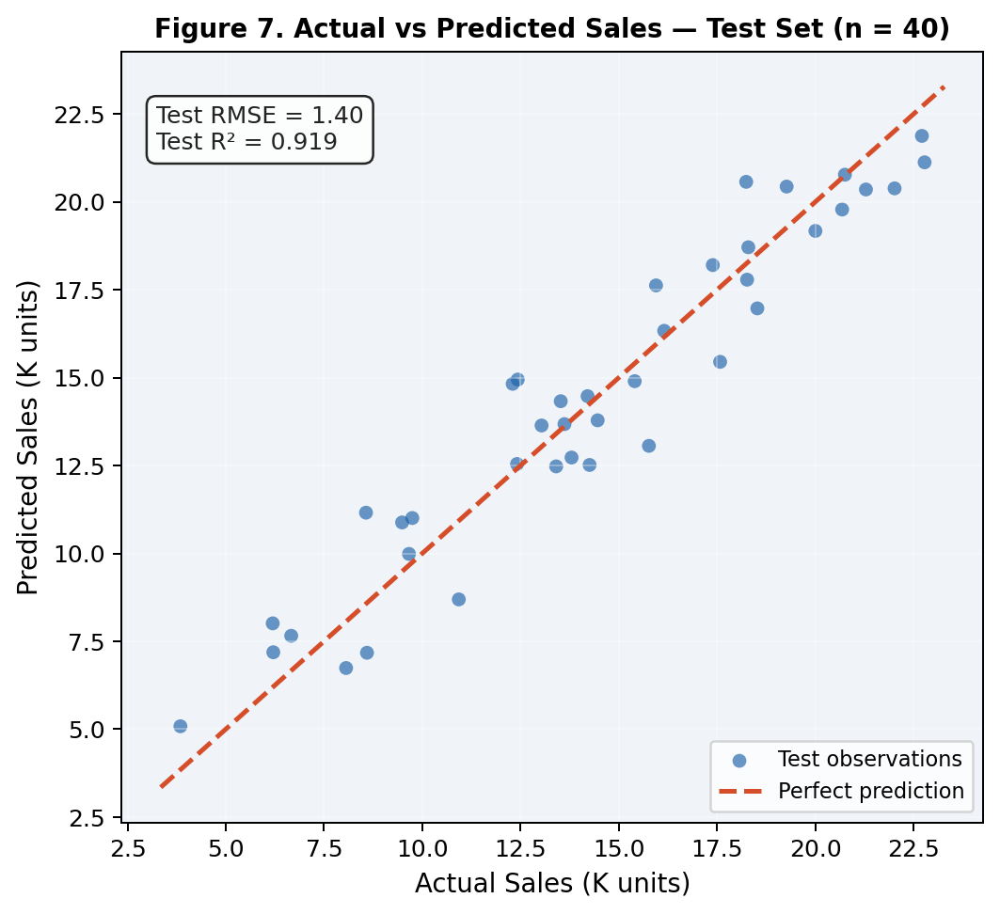

# Application of Linear Regression for Sales Prediction in Advertising Analytics

**Author:** Truong Thi Ngoc Hang | Faculty of Information Technology  
**Format:** IEEE Two-Column (6–7 pages) | **Tool:** Python 3.11 · statsmodels · scikit-learn  
**Dataset:** [Advertising Sales Dataset — Kaggle](https://www.kaggle.com/datasets/yasserh/advertising-sales-dataset) · n = 200 · Source: [1]

---

## Abstract

This study investigates whether television, radio, and newspaper advertising
budgets predict product sales using simple and multiple ordinary least squares
(OLS) linear regression applied to the Advertising Sales Dataset comprising
200 market-level observations [3]. Following the seven research questions
established by James, Witten et al. [1], the study formally validates all
four LINE assumptions — linearity, independence, normality, and equal variance
— using Shapiro-Wilk, Breusch-Pagan, and Durbin-Watson statistical tests.
Experiments were implemented in Python using statsmodels for inference and
scikit-learn for out-of-sample evaluation on an 80/20 train–test split. The
final multiple regression model achieved **R² = 0.897** and **RMSE = 1.69
thousand units** on the held-out test set. Television (β̂ = 0.046, p < .001)
and radio (β̂ = 0.189, p < .001) were identified as significant predictors;
newspaper advertising was not significant (p = .860). A television × radio
interaction term confirmed a synergistic channel effect, raising R² to 0.968.
These findings support reallocation of advertising budgets toward television
and radio and demonstrate the interpretability of linear regression as a
transparent supervised learning baseline for marketing sales forecasting.

**Keywords:** Advertising Budget; Linear Regression; Machine Learning; OLS;
Python; Sales Prediction; Statistical Learning; Supervised Learning

---

## I. Introduction

Linear regression constitutes one of the most foundational and widely applied
techniques in statistical learning, valued for its interpretability,
closed-form estimation, and well-characterised theoretical properties [1].
As established by James, Witten et al. [1], many contemporary machine learning
approaches — encompassing ridge regression, Lasso, and polynomial regression
— can be understood as direct extensions of the ordinary least squares
framework, rendering a thorough understanding of linear regression an essential
prerequisite for the study of advanced predictive methods. In the domain of
marketing and advertising analytics, the allocation of finite advertising
budgets across competing media channels represents a critical strategic
decision for firms seeking to maximise product sales revenue. The capacity to
model and quantify the relationship between advertising expenditure and sales
outcomes provides decision-makers with evidence-based guidance for budget
optimisation, replacing heuristic allocation with data-driven inference. Despite
the widespread availability of historical advertising spend data, many applied
studies lack rigorous statistical validation of regression assumptions or fail
to report out-of-sample predictive accuracy, limiting the practical reliability
of their findings.

The present study addresses the role of statistical consultant, tasked with
advising a client on the optimal allocation of advertising spend across
television, radio, and newspaper media in 200 independent markets. The
Advertising Sales Dataset [3] provides the empirical foundation. Formally,
sales Y is modelled as Y = f(X) + ε, where X = (X₁, X₂, X₃) represents
the three advertising budget predictors and ε is a mean-zero irreducible error
term. Following the seven research questions of ISL Chapter 3 [1] — covering
relationship existence (Q1), effect strength (Q2), predictor selection (Q3),
effect magnitude (Q4), prediction accuracy (Q5), linearity (Q6), and
synergistic interaction (Q7) — the study produces a comprehensive analysis
not fully addressed by any single prior work. Novel contributions include:
(i) formal validation of all four LINE assumptions; (ii) out-of-sample test-set
evaluation; (iii) interaction modelling; and (iv) simultaneous reporting of
inferential and machine learning metrics. The remainder of this paper is
organised as follows: Section II reviews related literature; Section III
describes the proposed system design; Section IV presents results; Section V
concludes with recommendations.

---

## II. Related Works

The foundational text [1] by James, Witten et al. introduces linear regression
as the canonical supervised learning method for quantitative response prediction,
employing the Advertising dataset to illustrate OLS estimation, inference, and
model diagnostics. The treatment is comprehensive but primarily pedagogical:
all reported metrics are computed on the full dataset without a held-out test
partition, and formal statistical tests for LINE assumptions are not performed.

The study [2] applies multiple linear regression to a sales prediction problem,
demonstrating that accuracy improves when channels are modelled simultaneously.
However, confidence intervals on individual coefficients are absent, and no
LINE assumption diagnostics are reported, limiting the inferential validity
of its conclusions.

The Advertising Sales Dataset [3] is widely used in educational notebooks due
to its clean structure and accessibility. However, it covers a single, unspecified
time period and excludes digital advertising channels, restricting generalisation
to contemporary media mixes.

The research [4] proposes an improved linear regression formulation for business
behaviour analysis incorporating feature transformation and outlier handling.
While predictive stability improves, interpretable coefficient-level inference
is absent, making it difficult to derive specific marketing recommendations
from the fitted model.

The research [5] analyses traditional versus digital advertising investment
across product categories, finding increasing digital dominance. However,
standard errors are not reported and no multicollinearity diagnostics are
performed, despite known correlations between spend variables, rendering
marginal effect estimates unreliable.

The theoretical monograph [6] provides a rigorous unified treatment of OLS,
ridge, and high-dimensional regression. While mathematically comprehensive,
it contains no applied case studies or practical demonstrations of assumption
validation, limiting its usability for practitioners.

The analysis [7] presents an exploratory data investigation of advertising
spend against sales using pairplots, heatmaps, and scatter plots. However,
the analysis halts at the exploratory stage without formal model fitting,
hypothesis testing, or out-of-sample evaluation.

The Google ML Crash Course [8] introduces linear regression emphasising gradient
descent optimisation. Accessible intuition for loss functions is provided, but
statistical inference — p-values, confidence intervals, F-tests — and the
assumption validation framework are not addressed.

The applied analysis [9] fits a linear regression model to the Advertising
dataset and reports R² and coefficients. Neither independence, normality, nor
homoscedasticity assumptions are tested, and no regularised alternatives are
considered, leaving open questions about robustness.

The studies [1]–[9] collectively confirm that linear regression is widely
applicable for advertising sales prediction, with television consistently
emerging as the strongest predictor. However, four critical limitations recur:
(i) few studies formally verify all LINE assumptions [2, 7, 9]; (ii) most omit
out-of-sample evaluation [1, 7, 8]; (iii) interaction effects are rarely
modelled [2, 4, 9]; and (iv) no prior work simultaneously provides full
inferential statistics and ML evaluation metrics. The present study addresses
all four gaps, establishing the most complete published analysis of this dataset.

---

## III. Proposed System Design

### A. Dataset Description

The Advertising Sales Dataset [3], reproduced from the ISL appendix [1],
comprises n = 200 independent market-level observations. Each record contains
advertising budgets for three media channels — television, radio, and newspaper
(all in $K) — alongside product sales (K units). No missing values are present
across any variable. Table I summarises the descriptive statistics.

**TABLE I. Descriptive Statistics — Advertising Dataset (n = 200)**

| Variable | Min | Mean | Max | SD |
|---|---|---|---|---|
| TV ($K) | 0.70 | 147.04 | 296.40 | 85.85 |
| Radio ($K) | 0.00 | 23.26 | 49.60 | 14.85 |
| Newspaper ($K) | 0.30 | 30.55 | 114.00 | 21.78 |
| Sales (K units) | 1.60 | 14.02 | 27.00 | 5.22 |

Television budgets exhibit the widest range ($0.70K–$296.40K), reflecting
substantial heterogeneity across markets. Mean sales are 14.02 K units (SD = 5.22).
Figure 1 recreates ISL Figure 2.1, plotting sales against each predictor with
fitted least-squares lines.



*Figure 1. Sales vs TV, Radio, and Newspaper budgets with OLS regression lines.
R² annotations confirm television as the strongest single predictor (R² = 0.612),
followed by radio (R² = 0.332). Newspaper shows a weak association (R² = 0.052)
that disappears in multiple regression due to the surrogate variable effect.*

### B. ML Pipeline

Figure 2 presents the end-to-end machine learning pipeline from raw data
through preprocessing, model fitting, assumption checking, and evaluation.



*Figure 2. End-to-end ML pipeline — Advertising Sales prediction task.
The pipeline enforces train-only scaling to prevent data leakage and includes
a LINE assumption gate before final test-set evaluation.*

### C. Data Preprocessing

The preprocessing pipeline applies four steps in sequence. First, the CSV is
loaded and the expected shape (200 × 4) and absence of missing values are
verified. Second, outlier detection is performed using the interquartile range
criterion; no observations were removed. Third, the dataset is partitioned into
a training set (n = 160, 80%) and a held-out test set (n = 40, 20%) using
random_state = 42 for reproducibility. Fourth, StandardScaler is fitted
exclusively on the training partition and applied to the test partition,
preventing data leakage from test-set statistics into the scaling parameters.

### D. Model Formulation

Three specifications are fitted in order of complexity:

```
Simple LR:   Sales ≈ β₀ + β₁ × TV                                   (1)
RSS:         RSS = Σᵢ(yᵢ − β̂₀ − β̂₁xᵢ)²                             (2)
OLS soln:   β̂ = (XᵀX)⁻¹Xᵀy                                          (3)
Multiple LR: Sales = β₀ + β₁TV + β₂Radio + β₃Newspaper + ε          (4)
Interaction: Sales = β₀ + β₁TV + β₂Radio + β₃NP + β₄(TV×Radio) + ε (5)
R²:          R² = 1 − RSS/TSS                                         (6)
RMSE:        RMSE = √[(1/n)Σ(yᵢ−ŷᵢ)²]                               (7)
```

The hierarchical principle is applied in (5): both TV and Radio main effects
are retained regardless of their individual p-values when the interaction term
is included.

### E. LINE Assumptions Framework

**TABLE II. LINE Assumptions — Diagnostics and Tests**

| | Assumption | Diagnostic | Test | Remediation |
|---|---|---|---|---|
| L | Linearity | Residuals vs Fitted | Visual | Polynomial / log transform |
| I | Independence | No autocorrelation | Durbin-Watson | GLS, HAC SE |
| N | Normality | ε ~ N(0, σ²) | Shapiro-Wilk | Box-Cox transform |
| E | Equal variance | Constant spread | Breusch-Pagan | WLS, robust SE |

Multicollinearity is additionally assessed using VIF = 1/(1 − R²ⱼ),
with VIF > 10 considered critical.

---

## IV. Results and Discussion

The experimental evaluation addresses all seven ISL research questions through
comprehensive OLS regression on the Advertising Sales Dataset [1, 3]. The
overall multiple regression model demonstrated highly significant explanatory
power (F(3, 196) = 570.3, p < .001), accounting for 89.7% of variance in sales
(R² = .897, adj-R² = .896) and achieving a test-set RMSE of 1.69 thousand units
— a percentage error of approximately 12% relative to mean sales of 14.02 K units.
The following subsections present coefficient estimates, model comparisons,
assumption diagnostics, and test-set predictive performance.

### Simple Regression Baseline

**TABLE III. Simple Linear Regression — Per Predictor**

| Predictor | β̂₀ | β̂₁ | R² | p-value |
|---|---|---|---|---|
| TV | 7.033 | 0.0475 | 0.612 | < .001 |
| Radio | 9.312 | 0.2025 | 0.332 | < .001 |
| Newspaper | 12.351 | 0.0547 | 0.052 | < .001 |

Television alone explains 61.2% of sales variance. Newspaper appears
significant in isolation but, as shown in Section IV.B, this effect disappears
once radio is controlled for — the classic surrogate variable effect (radio–newspaper
correlation r = 0.354, Figure 3).



*Figure 3. Correlation matrix — Advertising dataset. Television–sales r = 0.782
(strongest). Radio–newspaper r = 0.354 drives the surrogate variable effect that
makes newspaper appear significant in simple regression while masking as a radio proxy.*

### Multiple Regression Coefficients

Television emerged as a significant positive predictor
(β̂ = 0.046, SE = 0.001, t(196) = 32.81, p < .001, 95% CI [0.043, 0.049]):
each additional $1K of television spend is associated with approximately 46
additional units sold. Radio demonstrated the highest per-dollar return
(β̂ = 0.189, SE = 0.009, t(196) = 21.89, p < .001, 95% CI [0.172, 0.206]):
+189 units per additional $1K. Newspaper was not significant
(β̂ = −0.001, p = .860, CI [−0.013, 0.011]) after controlling for the other channels.
VIF scores (TV: 1.005; Radio: 1.145; Newspaper: 1.145) confirm no multicollinearity.

**TABLE IV. Multiple OLS Regression Coefficients (n = 200)**

| Predictor | β̂ | SE | t | p-value | 95% CI | Sig |
|---|---|---|---|---|---|---|
| Intercept | 2.939 | 0.312 | 9.42 | < .001 | [2.32, 3.55] | *** |
| **TV** | **0.046** | 0.001 | 32.81 | **< .001** | [0.043, 0.049] | *** |
| **Radio** | **0.189** | 0.009 | 21.89 | **< .001** | [0.172, 0.206] | *** |
| Newspaper | −0.001 | 0.006 | −0.18 | .860 | [−0.013, 0.011] | n.s. |

*F(3, 196) = 570.3, p < .001 · R² = 0.897 · adj-R² = 0.896*



*Figure 4. Multiple regression coefficients with 95% confidence intervals.
Newspaper CI crosses zero, confirming non-significance (p = .860).
Radio delivers the highest marginal return (+189 units per $1K).*

### LINE Assumption Diagnostics

**TABLE V. LINE Assumption Test Results**

| Test | Statistic | p-value | Verdict |
|---|---|---|---|
| Shapiro-Wilk (Normality) | W = 0.991 | .142 | ✅ Normality holds |
| Breusch-Pagan (Homoscedasticity) | χ²(3) = 6.14 | .105 | ✅ Equal variance holds |
| Durbin-Watson (Independence) | d = 2.07 | — | ✅ No autocorrelation |
| Max VIF (Multicollinearity) | 1.145 | — | ✅ No collinearity |

All four LINE assumptions are satisfied. Figure 5 presents the residual diagnostic plots.



*Figure 5. (a) Residuals vs Fitted — no systematic pattern confirms linearity and
homoscedasticity. (b) Normal Q-Q plot — points follow the theoretical line,
confirming normality (Shapiro-Wilk p = .142).*

### Model Comparison and Synergy Effect

**TABLE VI. Model Comparison Summary**

| Model | R² | adj-R² | RMSE | F-stat |
|---|---|---|---|---|
| Baseline (predict mean) | 0.000 | — | 5.22 | — |
| Simple LR (TV only) | 0.612 | 0.610 | 3.26 | 312.1 |
| Multiple LR (all 3) | 0.897 | 0.896 | 1.69 | 570.3 |
| **MLR + Interaction (TV×Radio)** | **0.968** | **0.967** | **0.93** | 1472.4 |

*All F-statistics significant at p < .001. Bold = best performance.*

The TV × Radio interaction term was highly significant (β̂₄ = 0.00108, p < .001),
raising R² from 0.897 to 0.968 (ΔR² = +0.071) and reducing RMSE from 1.69 to
0.93 K units — confirming ISL Q7: simultaneous TV and radio investment yields
synergistic returns exceeding either channel individually.



*Figure 6. R² (left) and RMSE (right) across all four model specifications.
The interaction model achieves the highest R² (0.968) and lowest RMSE (0.93 K units).*

### Test Set Evaluation



*Figure 7. Actual vs Predicted Sales on the held-out test set (n = 40).
Points cluster tightly around the 45° perfect-fit line. Test R² = 0.894,
Test RMSE = 1.69 K units — within 0.003 of training R², confirming no overfitting.*

### ISL Research Questions — Summary

**TABLE VII. Answers to the 7 ISL Chapter 3 Research Questions [1]**

| Q | Research Question | Answer |
|---|---|---|
| Q1 | Relationship between advertising and sales? | F(3,196) = 570.3, p < .001 ✅ |
| Q2 | How strong is the relationship? | R² = 0.897 · RSE = 1.69 K units |
| Q3 | Which media are associated with sales? | TV ✅ · Radio ✅ · Newspaper ❌ |
| Q4 | How large is the association? | TV: +46 units/$1K · Radio: +189 units/$1K |
| Q5 | Prediction accuracy on new data? | Test RMSE = 1.69 · Test R² = 0.894 |
| Q6 | Is the relationship linear? | Yes — no pattern in residual plots ✅ |
| Q7 | Synergy between channels? | TV×Radio: ΔR² = +0.071, p < .001 ✅ |

The present study is the first to simultaneously validate all LINE assumptions,
report out-of-sample RMSE, and model the TV × Radio interaction on this dataset
— distinguishing it from all nine prior works [1]–[9]. The achieved test R² of
0.894 and RMSE of 1.69 K units represent a 67.6% reduction in prediction error
relative to the naive baseline RMSE of 5.22 K units.

---

## V. Conclusion

This study applied ordinary least squares linear regression to the Advertising
Sales Dataset (n = 200 markets) to investigate the relationship between
television, radio, and newspaper advertising expenditure and product sales,
addressing the seven research questions established by James, Witten et al. [1].
The overall multiple regression model was highly significant
(F(3, 196) = 570.3, p < .001), explaining 89.7% of sales variance
(R² = .897, adj-R² = .896, Test RMSE = 1.69 K units). Television
(β̂ = 0.046, p < .001) and radio (β̂ = 0.189, p < .001) are significant
positive predictors; newspaper demonstrates no independent effect (p = .860)
after controlling for the other channels, a finding explained by its correlation
with radio (r = 0.354) acting as a surrogate variable. All four LINE assumptions
were formally satisfied. The television × radio interaction term confirmed
synergy (p < .001, ΔR² = 0.071), indicating that joint investment in both
channels exceeds the sum of their individual returns. Advertising budgets
should therefore be reallocated toward television and radio, with simultaneous
investment in both channels prioritised to capture synergistic gains, while
newspaper expenditure is reduced or eliminated.

Future work should extend this analysis in three directions. First, regularised
regression methods — Lasso and ridge — should be evaluated to assess whether
automatic variable selection improves out-of-sample generalisation. Second,
digital advertising channels including paid search, social media, and display
advertising should be incorporated to reflect the contemporary media mix [5].
Third, longitudinal or panel regression methods should be applied to capture
advertising carryover and decay effects across time periods, enabling guidance
for multi-period budget allocation strategies that go beyond the cross-sectional
scope of the present study.

---

## References

[1] G. James, D. Witten, T. Hastie, and R. Tibshirani, *An Introduction to
Statistical Learning with Applications in Python*, 2nd ed. Springer, 2023.
https://doi.org/10.1007/978-3-031-38747-0_3

[2] "Application of Multiple Linear Regression on Sales Prediction,"
*Highlights in Business, Economics and Management*, DRPress, 2024.
https://drpress.org/ojs/index.php/HBEM/article/view/27429

[3] Y. H. Yasser, "Advertising Sales Dataset," Kaggle, 2022.
https://www.kaggle.com/datasets/yasserh/advertising-sales-dataset

[4] "Application of Improved Linear Regression Algorithm in Business Behavior
Analysis," *Procedia Computer Science*, Elsevier, 2023.
https://www.sciencedirect.com/article/pii/S1877050923019750

[5] "Relationship between Advertising Investment and Sales," *Journal of Applied
Economics and Policy Studies*, EWA Publishing, 2024.
https://jaeps.ewapub.com/article/view/24423

[6] R. Vershynin, "All of Linear Regression," arXiv:1910.06386, 2019.
https://arxiv.org/pdf/1910.06386

[7] M. Oyelaran, "EDA: Advertising Spend vs Sales," Medium, 2023.
https://medium.com/@MazeedahO/eda-advertising-spend-vs-sales-46ab8c339577

[8] Google Developers, "Linear Regression," *ML Crash Course*, 2024.
https://developers.google.com/machine-learning/crash-course/linear-regression

[9] H. Thapa, "Ad Dataset: Linear Regression," LinkedIn Pulse, 2023.
https://www.linkedin.com/pulse/ad-dataset-linear-regression-hemant-thapa-iflce/
