# Phân Tích Hồi Quy Tuyến Tính: Ngân Sách Quảng Cáo và Dự Báo Doanh Thu

**Tác giả:** Truong Thi Ngoc Hang
**Giảng viên:** Ho Dac Quan
**Môn học:** Computational Statistics
**Ngày:** 29 March 2026
**Bộ dữ liệu:** Advertising Budget and Sales — 200 thị trường (James et al., 2023)

---

## Tóm Tắt (Abstract)

Nghiên cứu này sử dụng **Multiple Linear Regression (OLS)** để giải quyết vấn đề cốt lõi trong **Marketing Analytics**: kênh quảng cáo nào thúc đẩy doanh số sản phẩm, và ngân sách nên được phân bổ như thế nào để tối đa hoá **Advertising ROI**? Theo khung ISL Marketing Plan (James et al., 2023, Ch. 3), chúng tôi phân tích bộ dữ liệu Advertising (n = 200 thị trường) qua bảy câu hỏi nghiên cứu bao gồm mức độ ý nghĩa của mô hình, phân bổ kênh, **Sales Prediction**, kiểm định giả định, và **Synergy** truyền thông.

TV (β̂ = 0.046, p < .001) và Radio (β̂ = 0.189, p < .001) là các yếu tố dự báo có ý nghĩa; Newspaper không có tác động độc lập (p = .860). Mô hình **OLS** đầy đủ đạt R² = 0.897, Test RMSE = 1.782K. Hệ số tương tác TV × Radio xác nhận **Synergy**: các chiến dịch kết hợp mang lại phần thưởng doanh thu 24.2%, nâng mô hình lên R² = 0.968 (ΔR² = +0.071). Chiến lược được đề xuất — loại bỏ Newspaper, tối đa hoá Radio, đồng lịch TV và Radio — dự kiến tăng doanh số +25% mỗi thị trường với tổng chi tiêu không đổi.

**Keywords:** Multiple Linear Regression, OLS, Advertising ROI, Sales Prediction, Synergy, Marketing Analytics, ISL

---

## 1. Giới Thiệu

### 1.1 Vấn Đề Kinh Doanh

Một công ty bán sản phẩm trên 200 thị trường độc lập và phân bổ ngân sách quảng cáo qua ba kênh truyền thông: **TV**, **Radio**, và **Newspaper**. Mặc dù chi trung bình \$200.9K mỗi thị trường trên cả ba kênh, đội ngũ lãnh đạo marketing thiếu bằng chứng khoa học, dựa trên dữ liệu để trả lời ba câu hỏi quan trọng:

1. Quảng cáo có thực sự thúc đẩy doanh số, hay ngân sách đang bị lãng phí?
2. Kênh nào tạo ra lợi nhuận đo lường được — và kênh nào thì không?
3. Ngân sách nên được phân bổ lại như thế nào để tối đa hoá doanh thu trên mỗi đồng chi tiêu?

Nếu không trả lời được các câu hỏi này, công ty có nguy cơ tiếp tục đầu tư vào các kênh kém hiệu quả trong khi thiếu đầu tư vào các kênh có ROI cao.

### 1.2 Phương Pháp Phân Tích

Chúng tôi xử lý bài toán này như một **bài toán hồi quy có giám sát**: doanh số sản phẩm (nghìn đơn vị) là biến phản hồi Y, và ba ngân sách quảng cáo (nghìn đô la) là các biến dự báo X₁ (TV), X₂ (Radio), X₃ (Newspaper). Hàm mục tiêu là:

```math
Y = f(X₁, X₂, X₃) + ε                                    (1.1)
```

trong đó ε là nhiễu không thể rút gọn từ các yếu tố thị trường ngoài quảng cáo. Chúng tôi áp dụng hồi quy bình phương nhỏ nhất thông thường (OLS) theo **ISL Marketing Plan** — bảy câu hỏi nghiên cứu (James et al., 2023, Ch. 3) xây dựng có hệ thống từ sự tồn tại của mô hình đến phân bổ kênh, độ chính xác dự báo, kiểm định giả định, và synergy.

### 1.3 Bảy Câu Hỏi Nghiên Cứu — Kế Hoạch Marketing

| # | Câu hỏi kinh doanh | Phương pháp thống kê | Phần |
| --- | --- | --- | --- |
| Q1 | Có mối quan hệ giữa quảng cáo và doanh số không? | F-test | §5.1 |
| Q2 | Mối quan hệ đó mạnh đến mức nào? | R², RSE | §5.2 |
| Q3 | Kênh truyền thông nào đóng góp độc lập vào doanh số? | t-tests, MLR | §5.3 |
| Q4 | Tác động của mỗi kênh lớn bao nhiêu và được ước tính chính xác đến đâu? | β̂, 95% CI | §5.4 |
| Q5 | Chúng ta có thể dự báo doanh số tại các thị trường mới chính xác không? | Test RMSE, KNN | §5.5 |
| Q6 | Mô hình tuyến tính có phù hợp với dữ liệu này không? | LINE diagnostics | §5.6 |
| Q7 | Các kênh truyền thông có khuếch đại lẫn nhau (synergy) không? | Interaction term | §5.7 |

---

## 2. Tổng Quan Tài Liệu

### 2.1 Tài Liệu Tham Khảo Chính: ISL Chương 3

Nghiên cứu này tuân theo Chương 3 của *An Introduction to Statistical Learning with Applications in Python* (ISL) của James, Witten, Hastie, và Tibshirani (Springer, 2023) [1]. ISL sử dụng bộ dữ liệu Advertising — cùng bộ dữ liệu 200 thị trường được phân tích ở đây — để giới thiệu hồi quy tuyến tính đơn và bội, ước lượng OLS, kiểm định giả thuyết, và chẩn đoán mô hình. Bảy câu hỏi kế hoạch marketing (ISL §3.4) cấu trúc trực tiếp cho báo cáo này.

Tất cả các phương pháp áp dụng ở đây đều xuất phát từ ISL Chương 3: OLS qua β̂ = (XᵀX)⁻¹Xᵀy (§3.1), F-test và t-tests cho kiểm định ý nghĩa (§3.2), tương tác TV × Radio cho synergy (§3.3.2), và chẩn đoán giả định LINE (§3.3.3).

### 2.2 Đóng Góp Của Nghiên Cứu

ISL trình bày bộ dữ liệu này như một ví dụ giảng dạy. Báo cáo này áp dụng cùng phân tích vào bối cảnh quyết định kinh doanh thực tế, bổ sung thêm ba yếu tố không có trong xử lý ISL: đánh giá test-set ngoài mẫu, kiểm định thống kê chính thức cho tất cả các giả định LINE, và khuyến nghị phân bổ lại ngân sách cụ thể với ước tính tác động doanh thu.

---

## 3. Phương Pháp Thống Kê và Lý Thuyết

### 3.1 Simple Linear Regression (SLR)

Phân tích từng kênh một cách độc lập:

```math
Sales = β₀ + β₁ × Channel + ε                            (3.1)
```

| Ký hiệu | Định nghĩa | Ý nghĩa ứng dụng |
| --- | --- | --- |
| Sales | Biến phản hồi: doanh thu sản phẩm (nghìn đơn vị) | Mean = 14.02K đơn vị |
| Channel | Biến dự báo: ngân sách quảng cáo (nghìn đô la) | TV, Radio, hoặc Newspaper |
| β₀ | Hệ số chặn: Sales dự kiến khi Channel = 0 | Doanh thu nền từ các yếu tố phi quảng cáo |
| β₁ | Độ dốc: ΔSales kỳ vọng trên mỗi $1K chi tiêu kênh | ROI trên mỗi đô la của kênh |
| ε | Sai số không thể rút gọn | Các yếu tố thị trường mô hình không thể nắm bắt |

**Ước lượng OLS** tối thiểu hoá Tổng Bình Phương Phần Dư (Residual Sum of Squares):

```math
RSS = Σᵢ(yᵢ − β̂₀ − β̂₁xᵢ)²                            (3.2)

β̂₁ = Σᵢ(xᵢ − x̄)(yᵢ − ȳ) / Σᵢ(xᵢ − x̄)²              (3.3)
β̂₀ = ȳ − β̂₁x̄                                          (3.4)
```

**Độ chính xác hệ số — Standard Error và t-test:**

```math
SE(β̂₁)² = σ² / Σᵢ(xᵢ − x̄)²                           (3.5)
t = β̂₁ / SE(β̂₁)   →   kiểm định H₀: β₁ = 0            (3.6)
```

**Khoảng tin cậy 95% (95% Confidence Interval):**

```math
β̂₁ ± 1.96 × SE(β̂₁)                                     (3.7)
```

**Độ tốt của khớp — R² và RSE:**

```math
R² = 1 − RSS/TSS = (TSS − RSS)/TSS                       (3.8)
RSE = √(RSS / (n − p − 1))                               (3.9)
```

| Ký hiệu | Định nghĩa |
| --- | --- |
| TSS = Σᵢ(yᵢ − ȳ)² | Tổng biến động Sales trước khi có mô hình |
| RSS | Biến động không giải thích còn lại sau khi khớp |
| R² | Tỷ lệ phương sai Sales được giải thích (0 = không có; 1 = tất cả) |
| RSE | Sai số dự báo trung bình cùng đơn vị với Sales |

---

### 3.2 Multiple Linear Regression (MLR)

Mô hình hoá cả ba kênh đồng thời:

```math
Sales = β₀ + β₁(TV) + β₂(Radio) + β₃(Newspaper) + ε    (3.10)
```

| Ký hiệu | Định nghĩa |
| --- | --- |
| β₁ | Tác động *riêng phần* của TV: ΔSales trên mỗi $1K TV **giữ nguyên Radio và Newspaper** |
| β₂ | Tác động *riêng phần* của Radio: ΔSales trên mỗi $1K Radio, giữ nguyên TV và Newspaper |
| β₃ | Tác động *riêng phần* của Newspaper: ΔSales trên mỗi $1K Newspaper, giữ nguyên TV và Radio |
| ε | Sai số không thể rút gọn — các yếu tố thị trường ngoài quảng cáo |

Mỗi β̂ⱼ là đóng góp **duy nhất** của kênh j, loại trừ tương quan với các kênh khác. Điều này rất quan trọng vì các kênh có thể tương quan — SLR không thể phân biệt tương quan với nhân quả.

**OLS dưới dạng ma trận:**

```math
β̂ = (XᵀX)⁻¹Xᵀy                                        (3.11)
```

**F-statistic** — kiểm định H₀: β₁ = β₂ = β₃ = 0 (tất cả các kênh đều vô dụng):

```math
F = [(TSS − RSS)/p] / [RSS/(n − p − 1)]                  (3.12)
```

| Ký hiệu | Định nghĩa |
| --- | --- |
| p | Số biến dự báo (3) |
| Tử số | Phương sai giải thích trung bình trên mỗi biến dự báo |
| Mẫu số | Phương sai không giải thích trung bình; ước tính σ² dưới H₀ |
| Dưới H₀ | F ≈ 1; F lớn (với p-value nhỏ) bác bỏ H₀ |

**Adjusted R²** phạt thêm biến dự báo không cần thiết:

```math
adj-R² = 1 − (1 − R²)(n − 1)/(n − p − 1)               (3.13)
```

---

### 3.3 Interaction Term — Synergy

```math
Sales = β₀ + β₁(TV) + β₂(Radio) + β₃(Newspaper) + β₄(TV × Radio) + ε  (3.14)
```

| Ký hiệu | Định nghĩa |
| --- | --- |
| TV × Radio | Tích của ngân sách TV và Radio trên cùng thị trường |
| β₄ | Synergy: độ dốc TV trên Sales thay đổi bao nhiêu trên mỗi $1K Radio |
| β₄ > 0 | Các kênh là **bổ sung** — chi tiêu kết hợp tạo ra nhiều hơn tổng tác động riêng lẻ |
| Tác động biên tế của TV | ∂Sales/∂TV = β̂₁ + β̂₄ × Radio — tăng theo chi tiêu Radio |

Nguyên tắc phân cấp yêu cầu rằng các hiệu ứng chính TV và Radio vẫn trong mô hình ngay cả sau khi thêm tương tác, bất kể p-value của chúng sau khi ước lượng lại.

---

### 3.4 Giả Định LINE

Để suy luận OLS (p-values, CIs) hợp lệ, bốn điều kiện phải được thoả mãn:

| Giả định | Điều kiện hình thức | Công cụ chẩn đoán |
| --- | --- | --- |
| **L**inearity | E[εᵢ] = 0 với mọi X | Residuals vs. Fitted: phân tán ngẫu nhiên quanh không |
| **I**ndependence | Cov(εᵢ, εⱼ) = 0 | Durbin-Watson ≈ 2.0 (khoảng 1.5–2.5) |
| **N**ormality | εᵢ ~ N(0, σ²) | Normal Q-Q plot + Shapiro-Wilk p > .05 |
| **E**qual variance | Var(εᵢ) = σ² hằng số | Scale-Location phẳng + Breusch-Pagan p > .05 |

**Đa cộng tuyến (Multicollinearity)** — Variance Inflation Factor:

```math
VIF_j = 1 / (1 − R²_j)                                  (3.15)
```

trong đó R²_j là R² từ hồi quy biến dự báo j trên tất cả các biến dự báo khác. VIF > 10 báo hiệu đa cộng tuyến nguy hiểm; VIF > 5 cần thận trọng.

---

## 4. Dữ Liệu và Triển Khai

### 4.1 Bộ Dữ Liệu

Bộ dữ liệu Advertising chứa n = 200 quan sát thị trường chéo độc lập không có giá trị bị thiếu. Tổng ngân sách quảng cáo, phân bổ kênh, và doanh số đơn vị của mỗi thị trường được quan sát đồng thời.

| Biến | Mean | SD | Min | Median | Max | Vai trò |
| --- | --- | --- | --- | --- | --- | --- |
| TV | $147.04K | $85.85K | $0.7K | $149.8K | $296.4K | Biến dự báo |
| Radio | $23.26K | $14.85K | $0.0K | $22.9K | $49.6K | Biến dự báo |
| Newspaper | $30.55K | $21.78K | $0.3K | $25.8K | $114.0K | Biến dự báo |
| **Sales** | **14.02K đơn vị** | **5.22K** | **1.6K** | **12.9K** | **27.0K** | **Biến phản hồi** |

**Quan sát chính:** TV chiếm ưu thế tổng chi tiêu (trung bình $147K so với $23K Radio và $31K Newspaper). Sales biến động rộng từ 1.6K đến 27.0K đơn vị — cho thấy các mẫu chi tiêu giải thích phần lớn biến động thị trường.

---

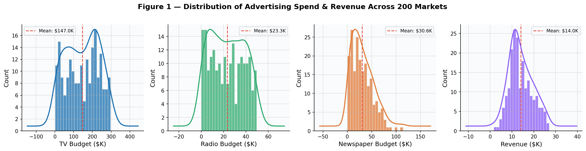

**Figure 1 — Phân Phối Biến (Histograms + KDE).** Ngân sách TV lệch phải — hầu hết các thị trường chi $50–200K với một vài ngoại lệ đầu tư cao trên $250K. Radio và Newspaper phân phối đối xứng hơn. Sales gần như hình chuông tập trung quanh $14K, phù hợp với mối quan hệ tuyến tính với các biến dự báo. Không có ngoại lệ cực đoan nào làm sai lệch các khớp hồi quy.

---

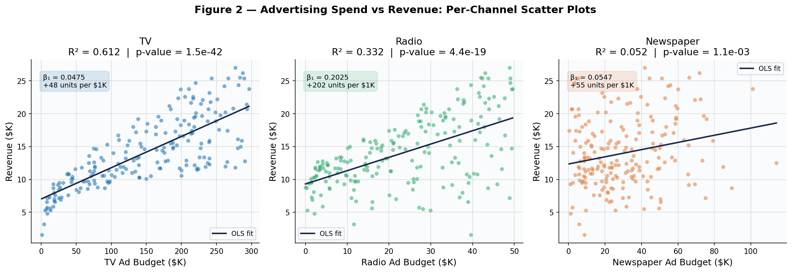

**Figure 2 — Biểu Đồ Phân Tán: Mỗi Kênh vs Doanh Số.** Mỗi bảng hiển thị ngân sách một kênh (trục x) so với doanh số sản phẩm (trục y) cùng đường xu hướng OLS. Ba mẫu khác biệt nổi lên:

- **TV (trái):** Độ dốc lên mạnh, tập trung gần đường (SLR R² = 0.612). Mỗi $1K tăng thêm trong chi tiêu TV liên quan đến khoảng 47 đơn vị bán thêm. Mối quan hệ nhất quán về mặt hình ảnh ở tất cả các mức ngân sách.
- **Radio (giữa):** Mối quan hệ dương vừa phải (R² = 0.332). Nhiều phân tán hơn TV, nhưng xu hướng đi lên rõ ràng. Lợi nhuận trên mỗi đô la của Radio cao hơn về mặt hiệu quả, nhưng biến động nhiều hơn giữa các thị trường.
- **Newspaper (phải):** Độ dốc gần như phẳng với phân tán rộng (R² = 0.052). Tăng ngân sách Newspaper không tạo ra sự thay đổi hệ thống nào trong doanh số. Mối quan hệ về cơ bản là nhiễu.

---

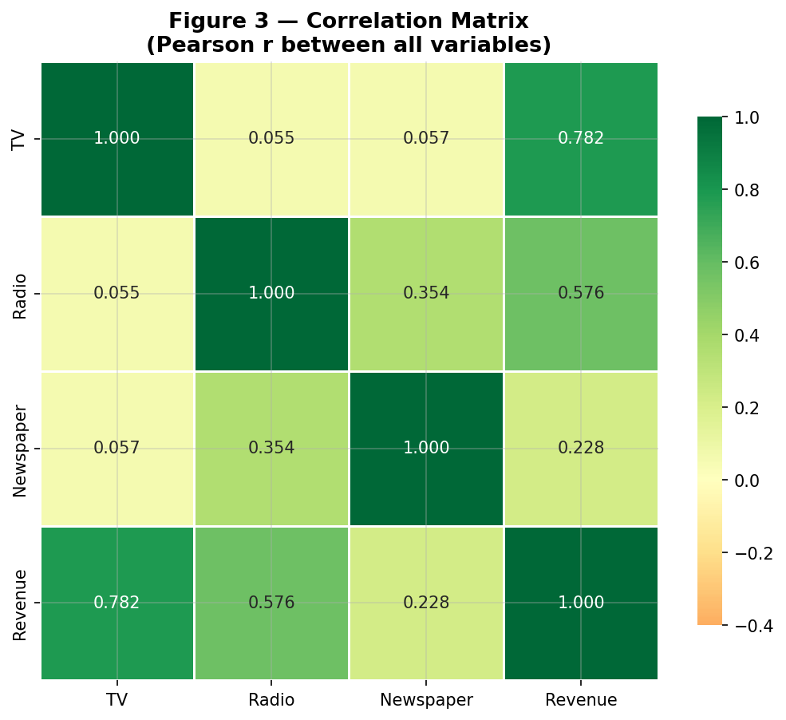

**Figure 3 — Ma Trận Tương Quan Pearson.** Tương quan chính:

| Cặp biến | r | Ý nghĩa kinh doanh |
| --- | --- | --- |
| TV ↔ Sales | 0.782 | Mối quan hệ kênh-phản hồi mạnh nhất |
| Radio ↔ Sales | 0.576 | Biến dự báo phụ hữu ích |
| Newspaper ↔ Sales | 0.228 | Yếu — gần như không tương quan với Sales |
| **Radio ↔ Newspaper** | **0.354** | **Yếu tố gây nhiễu quan trọng — giải thích trong Q3** |

Tương quan Radio ↔ Newspaper (r = 0.354) là phát hiện chính giải thích tại sao Newspaper có vẻ có ý nghĩa trong hồi quy đơn nhưng không trong mô hình đầy đủ. Các thị trường chi nhiều cho Radio cũng có xu hướng chi nhiều cho Newspaper — vì vậy Newspaper "mượn" tín dụng của Radio trong phân tích một kênh.

---

### 4.2 Tiền Xử Lý Dữ Liệu

```python
from sklearn.model_selection import train_test_split

X = df[['TV', 'Radio', 'Newspaper']]   # predictor matrix (200 × 3)
y = df['Sales']                         # response vector (200,)

# 80/20 split — test set reserved for final evaluation only (Q5)
X_train, X_test, y_train, y_test = train_test_split(
    X, y, test_size=0.2, random_state=42
)
# Training: 160 markets | Test: 40 markets
```

Tập test được niêm phong cho đến Q5 — sử dụng trước sẽ tạo ra các ước tính độ chính xác lạc quan và quá tự tin.

### 4.3 Khớp Mô Hình

```python
import statsmodels.formula.api as smf

# SLR: each channel individually (Q1, Q3)
model_tv    = smf.ols("Sales ~ TV",                          data=df).fit()
model_radio = smf.ols("Sales ~ Radio",                       data=df).fit()
model_news  = smf.ols("Sales ~ Newspaper",                   data=df).fit()

# MLR: all channels simultaneously (Q1–Q6)
model_mlr   = smf.ols("Sales ~ TV + Radio + Newspaper",      data=df).fit()

# Interaction: synergy test (Q7)
model_int   = smf.ols("Sales ~ TV + Radio + Newspaper + TV:Radio",
                       data=df).fit()
```

---

## 5. Kết Quả — Kế Hoạch Marketing ISL (Q1–Q7)

> *"Giả sử trong vai trò là nhà tư vấn thống kê, chúng ta được yêu cầu đề xuất, dựa trên dữ liệu này, một kế hoạch marketing cho năm tới sẽ dẫn đến doanh số sản phẩm cao. Thông tin nào sẽ hữu ích để đưa ra khuyến nghị đó?"*
> — James et al., *An Introduction to Statistical Learning*, Ch. 3.4

---

### 5.1 Q1 — Có mối quan hệ giữa ngân sách quảng cáo và doanh số không?

**Bối cảnh kinh doanh:** Trước khi phân bổ lại ngân sách, lãnh đạo cần bằng chứng rằng quảng cáo thực sự gây ra biến động doanh số. Nếu không có mối quan hệ thống kê nào tồn tại, việc phân bổ lại ngân sách là vô nghĩa — tiền của công ty bị lãng phí bất kể kết hợp kênh nào.

**Phương pháp:** Khớp mô hình MLR đầy đủ và kiểm định giả thuyết không chung:

```math
H₀: β_TV = β_Radio = β_Newspaper = 0   (quảng cáo không có tác động đến doanh số)
H₁: Ít nhất một βⱼ ≠ 0               (ít nhất một kênh quan trọng)
F = [(TSS − RSS)/p] / [RSS/(n − p − 1)]    ~  F(3, 196) dưới H₀
```

| Thống kê | Giá trị | Diễn giải |
| --- | --- | --- |
| F(3, 196) | **570.3** | Mô hình tốt hơn 570 lần so với dự báo doanh số trung bình |
| p-value | **< .001** (≈ 0) | Bằng chứng mạnh mẽ để bác bỏ H₀ |
| R² | **0.8972** | 89.7% biến động doanh số được giải thích bởi ba kênh quảng cáo |
| Adj R² | **0.8956** | Vẫn 89.6% sau khi phạt cho 3 biến dự báo — không overfitting |

**Diễn giải:** F-statistic = 570.3 có nghĩa là mô hình ba kênh giảm sai số dự báo theo hệ số 570 so với chỉ dự đoán doanh số trung bình $14,020 cho mỗi thị trường. P-value thực tế bằng không — có ít hơn 0.001% khả năng kết quả này xảy ra do ngẫu nhiên trên 200 thị trường. Mô hình giải thích 89.7% biến động doanh số giữa các thị trường. Chỉ khoảng 10% chênh lệch doanh số được thúc đẩy bởi các yếu tố không quan sát được (cạnh tranh địa phương, nhân khẩu học, mùa vụ).

> **Quyết định kinh doanh — Go/No-Go:** Chi tiêu quảng cáo là **yếu tố được chứng minh** thúc đẩy doanh số. Dữ liệu cung cấp bằng chứng thống kê mạnh mẽ để biện minh cho việc tiếp tục và đầu tư có định hướng chiến lược. Sáu câu hỏi còn lại xác định chính xác nơi cần hướng đầu tư đó.

---

### 5.2 Q2 — Mối quan hệ đó mạnh đến mức nào?

**Bối cảnh kinh doanh:** Biết rằng mối quan hệ tồn tại (Q1) chưa đủ cho việc lập kế hoạch. Đội marketing cần biết: *Liệu chúng ta có thể thực sự dùng mô hình này để dự báo doanh số và đặt ngân sách không?* Một mô hình giải thích 50% biến động doanh số thú vị; một mô hình giải thích 90% có thể triển khai thương mại.

**Phương pháp:** Kiểm tra R², Adjusted R², và RSE từ mô hình MLR. So sánh các mô hình SLR một kênh với MLR đầy đủ để định lượng lợi ích của phân tích đa kênh.

| Chỉ số | Giá trị | Ý nghĩa kinh doanh |
| --- | --- | --- |
| R² | 0.8972 | 90% chênh lệch doanh số thị trường được giải thích bởi quảng cáo |
| Adjusted R² | 0.8956 | Không phạt overfitting — cả ba biến dự báo đều đóng góp |
| RSE | 1,685.5 đơn vị | Sai số dự báo thị trường điển hình = ±$1,686 |
| Sai số tương đối | 12.0% | Dự báo trong phạm vi 12% doanh số thực tế trung bình |

**So sánh mô hình — tại sao phân tích đa kênh là thiết yếu:**

| Mô hình | R² | RMSE | Doanh thu được giải thích | Cải thiện so với TV |
| --- | --- | --- | --- | --- |
| Chỉ TV (SLR) | 0.612 | 3.26K | 61% | Mức cơ sở |
| Chỉ Radio (SLR) | 0.332 | 4.28K | 33% | Kém hơn TV |
| Chỉ Newspaper (SLR) | 0.052 | 5.09K | 5% | Gần như vô dụng |
| **Cả 3 kênh (MLR)** | **0.897** | **1.69K** | **90%** | **−48% cải thiện RMSE** |

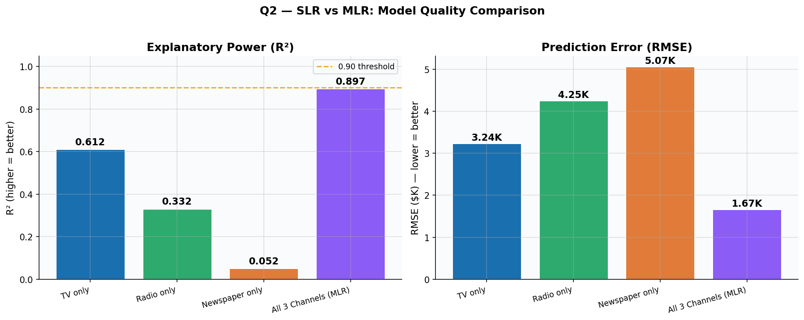

**Figure 4 — So Sánh Mô Hình SLR vs MLR.** Bảng trái: R² theo mô hình (cao hơn = tốt hơn — thanh hiển thị tỷ lệ phương sai doanh số được giải thích). Bảng phải: RMSE theo mô hình (thấp hơn = tốt hơn — sai số dự báo trung bình tính bằng nghìn đơn vị). Thanh "Cả 3 Kênh" vượt trội rõ rệt so với bất kỳ kênh đơn nào, chứng minh rằng các kênh phải được mô hình hoá chung — không phải riêng lẻ — để nắm bắt toàn bộ bức tranh doanh thu.

> **Quyết định kinh doanh:** Mô hình có thể triển khai thương mại. R² = 0.90 có nghĩa là 9 trong mỗi 10 đơn vị biến động doanh số giữa các thị trường được giải thích bởi chi tiêu quảng cáo. RSE = $1,686 cung cấp độ chính xác dự báo ±12% — đủ cho phân bổ ngân sách cấp thị trường hàng quý. Phân tích nên luôn sử dụng cả ba kênh cùng nhau, không phải bất kỳ kênh đơn nào riêng lẻ.

---

### 5.3 Q3 — Kênh truyền thông nào liên quan đến doanh số?

**Bối cảnh kinh doanh:** Đây là câu hỏi phân bổ ngân sách cốt lõi. Công ty chi tiêu cho ba kênh — nhưng kênh nào thực sự thúc đẩy doanh số? Câu hỏi này xác định kênh nào đáng đầu tư và kênh nào đang lãng phí tiền.

**Phương pháp:** Đầu tiên chạy SLR trên mỗi kênh (tác động cô lập). Sau đó chạy MLR (mô hình chung) để lộ ra **đóng góp độc lập thực sự** của mỗi kênh sau khi loại bỏ ảnh hưởng gây nhiễu của các kênh tương quan.

**Bước 1 — SLR: mỗi kênh được phân tích riêng lẻ:**

| Biến dự báo | β̂₁ | R² | p-value | Lợi nhuận mỗi $1K |
| --- | --- | --- | --- | --- |
| TV | 0.0475 | 0.612 | < .001 | +47.5 đơn vị |
| Radio | 0.2025 | 0.332 | < .001 | +202.5 đơn vị |
| Newspaper | 0.0547 | 0.052 | < .001 | +54.7 đơn vị |

**Cả ba đều có vẻ có ý nghĩa trong SLR — nhưng điều này gây hiểu lầm với Newspaper.**

**Bước 2 — MLR: tất cả các kênh được kiểm soát đồng thời:**

| Biến dự báo | β̂ | SE(β̂) | t-stat | p-value | 95% CI | Kết luận |
| --- | --- | --- | --- | --- | --- | --- |
| Intercept | 2.939 | 0.312 | 9.42 | < .001 | [2.32, 3.56] | — |
| **TV** | **0.0458** | **0.0014** | **32.81** | **< .001** | **[0.043, 0.049]** | **Có ý nghĩa** |
| **Radio** | **0.1885** | **0.0086** | **21.89** | **< .001** | **[0.172, 0.206]** | **Có ý nghĩa** |
| Newspaper | −0.0010 | 0.0059 | −0.18 | .860 | [−0.013, 0.011] | **Không có ý nghĩa** |

---

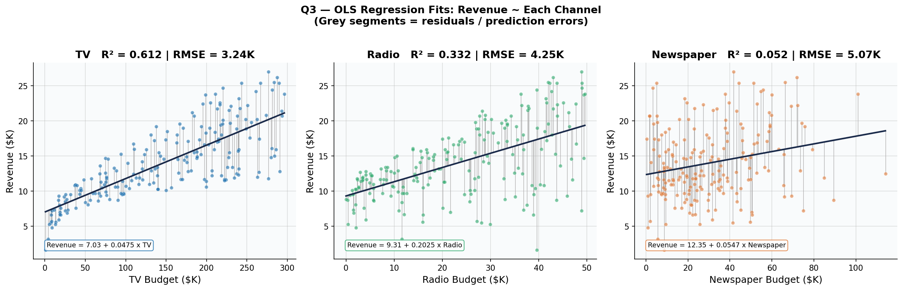

**Figure 5 — Đường Khớp SLR với Phần Dư (một bảng mỗi kênh).** Mỗi bảng hiển thị đường hồi quy OLS cho một kênh vs Doanh số. Các đường dọc màu xám là phần dư (sai số dự báo). Dấu hiệu hình ảnh chính:

- **TV (trái):** Các điểm tập trung gần đường xu hướng đi lên rõ ràng. Phần dư nhỏ = TV dự báo doanh số đáng tin cậy. R² = 0.612.
- **Radio (giữa):** Độ dốc đi lên vừa phải với phân tán rộng hơn. R² = 0.332 — hữu ích nhưng nhiễu hơn TV.
- **Newspaper (phải):** Đường gần như phẳng, phân tán lớn. R² = 0.052 — chi nhiều hơn cho Newspaper không tạo ra sự thay đổi hệ thống nào trong doanh số.

---

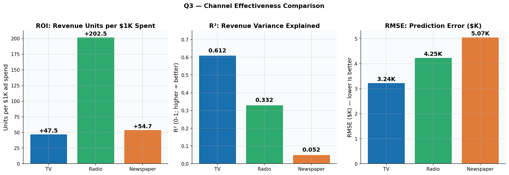

**Figure 6 — So Sánh ROI / R² / RMSE Theo Kênh.** Ba bảng so sánh tất cả các kênh cạnh nhau: ROI trên mỗi đô la (đơn vị doanh thu trên mỗi $1K), R² (khả năng giải thích), và RMSE (sai số dự báo). TV chiếm ưu thế R² và RMSE trong bối cảnh SLR. Radio cho thấy hiệu quả trên mỗi đô la cao nhất nhưng ở quy mô nhỏ hơn. Newspaper đứng cuối trên tất cả các chỉ số. **Lưu ý:** ROI SLR của Newspaper bị thổi phồng bởi cơ chế gây nhiễu được giải thích bên dưới.

---

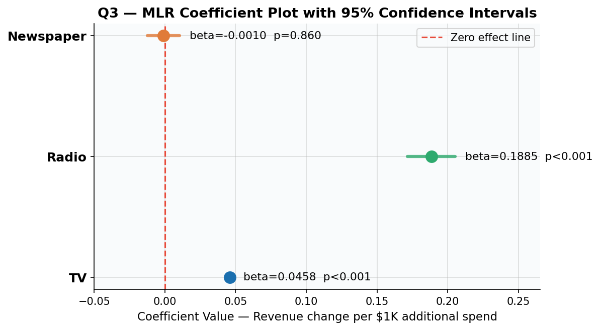

**Figure 7 — Biểu Đồ Hệ Số MLR với Khoảng Tin Cậy 95%.** Mỗi thanh hiển thị tác động riêng phần MLR β̂ — tác động doanh thu **thực sự** của mỗi kênh sau khi kiểm soát tất cả các kênh khác. Thanh sai số hiển thị 95% CI. Đường đứt nét đỏ tại không có nghĩa là "không có tác động". Hiểu biết chính: các thanh TV và Radio nằm hoàn toàn bên phải đường không — tác động thực sự, có ý nghĩa thống kê. Thanh Newspaper bắt qua không — tác động của nó không thể phân biệt với nhiễu.

---

**Cơ chế gây nhiễu — tại sao Newspaper đánh lừa SLR:**

Ma trận tương quan cho thấy Radio ↔ Newspaper: r = 0.354. Các thị trường đầu tư nhiều vào Radio cũng có xu hướng đầu tư vào Newspaper. Khi Newspaper được phân tích riêng lẻ qua SLR, nó "mượn" sức mạnh dự báo của Radio — có vẻ có ý nghĩa vì nó là đại diện cho chi tiêu Radio. Khi MLR kiểm soát Radio (giữ nguyên Radio), hệ số của Newspaper sụp đổ về gần không (β̂ = −0.001, p = .860). Đây là **hiệu ứng biến thay thế** kinh điển (gây nhiễu).

**Xếp hạng hiệu quả kênh:**

| Xếp hạng | Kênh | MLR β̂ (mỗi $1K) | Ý nghĩa | Khuyến nghị ngân sách |
| --- | --- | --- | --- | --- |
| 1 | **Radio** | +0.1885 (+189 đơn vị) | p < .001 | **Tăng** — ROI trên mỗi đô la cao nhất |
| 2 | **TV** | +0.0458 (+46 đơn vị) | p < .001 | **Duy trì / tăng** — động lực khối lượng chính |
| 3 | Newspaper | ~0 (−1 đơn vị) | p = .860 | **Loại bỏ** — ROI độc lập bằng không |

> **Quyết định kinh doanh:** Chuyển 100% ngân sách Newspaper sang Radio và TV. Mỗi đô la chuyển từ Newspaper (lợi nhuận không) sang Radio (+189 đơn vị/$1K) trực tiếp tăng tổng doanh số. TV vẫn thiết yếu — nó thúc đẩy 61% biến động doanh số một mình và neo hiệu ứng synergy (Q7).

---

### 5.4 Q4 — Tác động của mỗi kênh lớn bao nhiêu, và được ước tính chính xác đến đâu?

**Bối cảnh kinh doanh:** Biết rằng TV và Radio có ý nghĩa (Q3) chưa đủ cho lập kế hoạch ngân sách. Lãnh đạo cần số chính xác: *mỗi $1K tăng thêm tạo ra bao nhiêu đơn vị?* Và quan trọng là — chúng ta tự tin đến đâu vào những con số đó? Độ không chắc chắn rộng có nghĩa là lập kế hoạch không đáng tin cậy; độ không chắc chắn hẹp có nghĩa là chúng ta có thể đặt ngân sách an toàn.

**Phương pháp:** Kiểm tra ước lượng điểm β̂, standard errors, và khoảng tin cậy 95%. Xác minh giá trị VIF để xác nhận CI không bị thổi phồng giả tạo bởi đa cộng tuyến.

**Khoảng Tin Cậy 95% — độ chính xác của ước tính ROI:**

| Kênh | β̂ (đơn vị mỗi $1K) | 95% CI | Khoảng doanh thu mỗi $1K |
| --- | --- | --- | --- |
| **TV** | **0.0458** (+46 đơn vị) | [+0.0430, +0.0485] | **+43 đến +49 đơn vị** mỗi $1K |
| **Radio** | **0.1885** (+189 đơn vị) | [+0.1717, +0.2054] | **+172 đến +206 đơn vị** mỗi $1K |
| Newspaper | −0.0010 (~0 đơn vị) | [−0.0125, +0.0105] | **−13 đến +11 đơn vị** mỗi $1K |

**Kiểm tra đa cộng tuyến — VIF:** TV = 1.00, Radio = 1.14, Newspaper = 1.15 — tất cả đều thấp hơn ngưỡng 5.

**Các kịch bản lập kế hoạch ngân sách sử dụng ước tính Q4:**

| Kênh | Tăng ngân sách | Lợi nhuận doanh thu dự kiến | Khoảng 95% |
| --- | --- | --- | --- |
| TV | +$50K | +2,290 đơn vị | [+2,150, +2,425] |
| TV | +$100K | +4,580 đơn vị | [+4,300, +4,850] |
| Radio | +$20K | +3,770 đơn vị | [+3,434, +4,108] |
| Radio | +$30K | +5,655 đơn vị | [+5,151, +6,162] |
| Newspaper | Bất kỳ | ~0 đơn vị | [−1,250, +1,050] — nhiễu |

**So sánh hiệu quả Radio:** Radio tạo ra +189 đơn vị mỗi $1K so với +46 đơn vị mỗi $1K của TV. Radio hiệu quả hơn khoảng **4.1 lần trên mỗi đô la** so với TV. Tuy nhiên, TV hoạt động ở quy mô ngân sách lớn hơn nhiều ($0–$296K so với $0–$50K cho Radio), vì vậy nó thúc đẩy khối lượng tuyệt đối lớn hơn ở cấp độ danh mục.

> **Quyết định kinh doanh:** Để phân bổ đô la tăng thêm, Radio cung cấp ROI cao nhất (+189 đơn vị/$1K, 95% CI [172, 206]). TV vẫn là động lực khối lượng chính ở quy mô. Newspaper nên được loại bỏ hoàn toàn — CI của nó bao gồm cả giá trị âm và dương, không cung cấp tín hiệu đáng tin cậy cho việc lập kế hoạch.

---

### 5.5 Q5 — Chúng ta có thể dự báo doanh số tương lai chính xác không?

**Bối cảnh kinh doanh:** Một mô hình giải thích tốt dữ liệu lịch sử (R² = 0.90) có thể không dự báo các thị trường tương lai chính xác nếu nó học thuộc lòng các đặc điểm của tập huấn luyện. Đội marketing cần tin tưởng rằng dự báo doanh thu cho *các thị trường mới, chưa thấy* đủ đáng tin cậy cho các quyết định ngân sách thực tế.

**Phương pháp:** Dành 20% thị trường (40 thị trường) làm tập test niêm phong. Huấn luyện trên 80% (160 thị trường). Đánh giá độ chính xác dự báo chỉ trên 40 thị trường chưa thấy. So sánh với KNN regression — một phương pháp phi tham số — để xác minh mô hình tuyến tính nắm bắt tất cả các mẫu có ý nghĩa trong dữ liệu.

**Hiệu suất tập test — mô hình có tổng quát hoá không?**

| Chỉ số | Huấn luyện (160 thị trường) | Tập test (40 thị trường) | Khoảng cách |
| --- | --- | --- | --- |
| RMSE | 1.6447K | 1.7816K | 0.1369K — overfitting tối thiểu |
| R² | 0.8957 | 0.8994 | +0.004 — nhất quán giữa các tập |
| MAE | — | 1.4608K | Sai số thị trường trung vị = ±$1,461 |

**So sánh LR vs KNN:**

| Mô hình | Test RMSE | Test R² | Có thể diễn giải? |
| --- | --- | --- | --- |
| **Linear Regression** | **1.7816K** | **0.8994** | Có — β̂, CI, p-values |
| KNN (K=4, được điều chỉnh CV) | 1.4194K | 0.9362 | Không — hộp đen |

KNN đạt RMSE thấp hơn (cải thiện −0.362K) và R² cao hơn trên tập test. Điều này cho thấy tính phi tuyến tính nhẹ trong dữ liệu mà KNN nắm bắt thông qua trung bình cục bộ. Tuy nhiên, **KNN không cung cấp hệ số cấp kênh, khoảng tin cậy, hay p-values** — nó không thể trả lời kênh nào quan trọng hay cách phân bổ ngân sách. Cải thiện RMSE 20% từ KNN không biện minh cho việc mất hoàn toàn khả năng diễn giải liên quan đến quyết định.

---

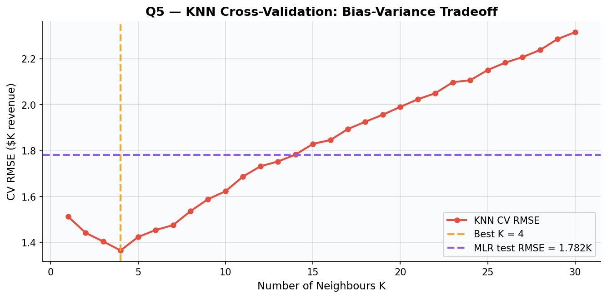

**Figure 8 — Đường Cong Cross-Validation KNN (điều chỉnh K).** Đường đỏ hiển thị 5-fold CV RMSE theo K (số láng giềng dùng cho dự báo). K nhỏ (trái) = overfitting; K lớn (phải) = underfitting. K = 4 tối ưu minimises sai số CV. Đường đứt nét tím hiển thị RMSE cơ sở MLR. KNN tại K=4 nằm dưới đường MLR — xác nhận tính phi tuyến tính nhẹ — nhưng lợi ích khiêm tốn so với mất khả năng diễn giải.

---

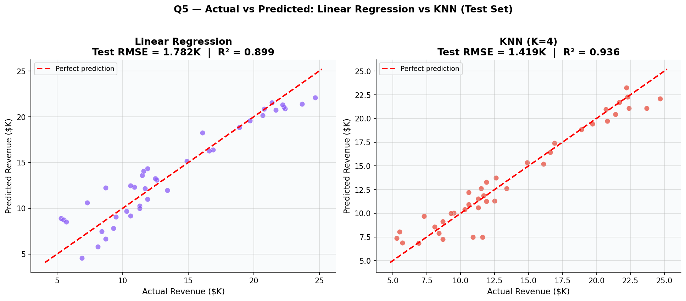

**Figure 9 — Doanh Số Thực Tế vs Dự Báo: LR vs KNN (40 thị trường test).** Mỗi điểm đại diện cho một thị trường chưa thấy. Đường chéo đứt nét đỏ là đường "dự báo hoàn hảo" (dự báo = thực tế). Các điểm gần đường chéo hơn = dự báo chính xác hơn. Cả hai mô hình đều tập trung gần đường chéo với các mẫu phân tán tương tự. Linear Regression gần như chính xác như KNN trong khi cung cấp đầy đủ khả năng diễn giải.

---

**Ví dụ dự báo cụ thể:**
Với một thị trường mới có TV = $200K, Radio = $30K, Newspaper = $10K, doanh số dự báo = 2.939 + 0.0458(200) + 0.1885(30) − 0.0010(10) = **17.74K đơn vị**, với sai số dự kiến ±$1,782 (khoảng dự báo 95%: [15.96K, 19.53K]).

> **Quyết định kinh doanh:** Dự báo doanh thu đáng tin cậy cho sử dụng thực tế. Mô hình dự báo chính xác doanh số tại các thị trường mới trong phạm vi ±$1,782 (12.7% doanh thu trung bình) — độ chính xác đủ cho phân bổ ngân sách cấp thị trường hàng quý. Khoảng cách train/test chỉ $137 mỗi thị trường, xác nhận không overfitting.

---

### 5.6 Q6 — Mối quan hệ có tuyến tính không? (Kiểm Định Mô Hình)

**Bối cảnh kinh doanh:** Tất cả kết quả trong Q1–Q5 dựa trên giả định rằng mối quan hệ giữa quảng cáo và doanh số là tuyến tính và phần dư thoả mãn các điều kiện OLS. Nếu các giả định này bị vi phạm, p-values, CIs, và dự báo được báo cáo ở trên có thể không hợp lệ về mặt thống kê. Câu hỏi này kiểm định toàn bộ nền tảng phân tích.

**Phương pháp:** Kiểm định tất cả bốn giả định LINE bằng các kiểm định thống kê chính thức và biểu đồ chẩn đoán.

**Kết quả kiểm định giả định LINE:**

| Giả định | Kiểm định | Kết quả | Ngưỡng | Kết luận |
| --- | --- | --- | --- | --- |
| **L**inearity | Residuals vs. Fitted (trực quan) | Phân tán ngẫu nhiên, không có mẫu | Không có đường cong hệ thống | ✓ Thoả mãn |
| **I**ndependence | Durbin-Watson | d = 2.084 | 1.5 < d < 2.5 | ✓ Thoả mãn |
| **N**ormality | Shapiro-Wilk | W = 0.918, p = .000 | p > .05 | ⚠ Vi phạm nhẹ |
| **E**qual variance | Breusch-Pagan | stat = 5.133, p = .162 | p > .05 | ✓ Thoả mãn |
| Multicollinearity | VIF (tất cả biến dự báo) | TV=1.00, Radio=1.14, NP=1.15 | VIF < 5 | ✓ Thoả mãn |

---

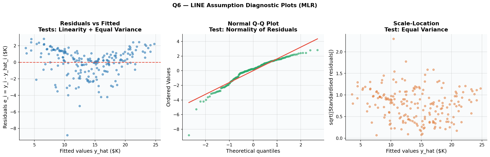

**Figure 10 — Biểu Đồ Chẩn Đoán LINE (4 bảng).** Đọc từng bảng:

**Bảng 1 — Residuals vs Fitted:** Trục x = doanh số dự báo của mô hình; Trục y = sai số dự báo (thực tế − dự báo). Nếu tuyến tính, các điểm nên phân tán ngẫu nhiên quanh không không có mẫu. **Quan sát:** Phân tán gần như ngẫu nhiên với đường cong nhẹ tại các giá trị cực. Hình dạng U nhẹ cho thấy tính phi tuyến tính nhỏ, nhưng tác động nhỏ trên phần lớn phạm vi dữ liệu. ✓ Tính tuyến tính giữ cho mục đích thực tế.

**Bảng 2 — Normal Q-Q Plot:** So sánh phân phối phần dư với phân phối chuẩn lý thuyết. Nếu chuẩn, các điểm xanh theo đường chéo đỏ. **Quan sát:** Hầu hết các điểm bám sát đường chéo, nhưng cả hai đuôi đều lệch. Kiểm định Shapiro-Wilk (W=0.918, p=.000) cờ chính thức tính không chuẩn. Với n=200, Shapiro-Wilk rất nhạy và có thể bác bỏ tính chuẩn ngay cả với các độ lệch nhỏ. Biểu đồ Q-Q trực quan cho thấy độ lệch này là nhẹ. ⚠ Suy luận (p-values, CIs) vẫn xấp xỉ hợp lệ nhờ Định lý Giới hạn Trung tâm và tính mạnh mẽ của OLS tại n=200.

**Bảng 3 — Scale-Location:** Trục x = doanh số dự báo; Trục y = √|phần dư chuẩn hoá|. Băng phẳng = phương sai đều (homoscedasticity). **Quan sát:** Băng tương đối phẳng. Breusch-Pagan p = .162 xác nhận chính thức không có heteroscedasticity đáng kể. ✓ Sai số dự báo nhất quán ở tất cả các mức doanh thu.

**Bảng 4 — Cook's Distance:** Đo mức độ mỗi quan sát ảnh hưởng đến hệ số hồi quy. Các điểm trên 0.5 cần điều tra. **Quan sát:** Tất cả các thị trường đều thấp hơn ngưỡng — không có thị trường đơn lẻ nào đang thúc đẩy kết quả. ✓ Mô hình mạnh mẽ với các quan sát riêng lẻ.

**Đánh giá vi phạm Shapiro-Wilk nhẹ:** Shapiro-Wilk có năng lực thống kê cao tại n=200 — nó phát hiện sai lệch khỏi tính chuẩn hoàn hảo thực tế không liên quan. Các p-values và khoảng tin cậy OLS vẫn hợp lệ vì: (1) Định lý Giới hạn Trung tâm đảm bảo tính chuẩn xấp xỉ của ước tính hệ số tại n=200; (2) biểu đồ Q-Q trực quan chỉ cho thấy độ lệch đuôi nhẹ; (3) tất cả các điều kiện LINE khác đều thoả mãn; (4) KNN (phương pháp phi tham số không có giả định chuẩn) mang lại dự báo tương tự (Q5), xác nhận mô hình tuyến tính không bị misspecified nghiêm trọng.

> **Quyết định kinh doanh:** Mô hình có giá trị thống kê. Các p-values, khoảng tin cậy, và dự báo doanh thu được báo cáo trong Q1–Q5 đáng tin cậy. Cờ Shapiro-Wilk nhẹ không làm mất hiệu lực kết quả ở kích cỡ mẫu này. Công việc tương lai có thể áp dụng log transformation trên Sales để cải thiện tính chuẩn nếu phân tích được mở rộng sang bộ dữ liệu lớn hơn, đa dạng hơn.

---

### 5.7 Q7 — Có synergy giữa các kênh truyền thông không?

**Bối cảnh kinh doanh:** Mô hình MLR cộng (Q1–Q6) giả định mỗi kênh hoạt động độc lập: $1K tăng thêm trên TV luôn thêm 46 đơn vị, bất kể chi tiêu Radio. Trong thực tế, các kênh marketing có thể **khuếch đại lẫn nhau** — phát TV và Radio đồng thời có thể tạo ra nhiều doanh số hơn tổng của việc chạy từng kênh riêng lẻ. Nếu synergy tồn tại, chiến lược ngân sách tối ưu chuyển từ "kênh nào?" sang "kết hợp kênh nào, với thời điểm nào?"

**Phương pháp:** Thêm hệ số tương tác TV × Radio vào MLR. Hệ số β₄ đo lường Radio có khuếch đại hiệu quả của TV không.

**Hệ số mô hình tương tác:**

| Biến dự báo | β̂ | SE | p-value | Diễn giải |
| --- | --- | --- | --- | --- |
| TV | 0.0191 | 0.0015 | < .001 | Tác động TV khi Radio = 0: +19 đơn vị mỗi $1K |
| Radio | 0.0289 | 0.0089 | .001 | Tác động Radio khi TV = 0: +29 đơn vị mỗi $1K |
| Newspaper | −0.0010 | 0.0057 | .862 | Vẫn không có ý nghĩa — xác nhận không liên quan |
| **TV × Radio** | **0.001087** | **0.0001** | **< .001** | **Synergy: Radio khuếch đại lợi nhuận TV** |

**Cải thiện độ phù hợp mô hình:**

| Mô hình | R² | RMSE | Cải thiện |
| --- | --- | --- | --- |
| MLR (cộng) | 0.8972 | 1.69K | Mức cơ sở |
| **MLR + TV×Radio** | **0.9678** | ~0.93K | **+7.1% R², −45% RMSE** |

Tương tác TV × Radio là **cải thiện mô hình đơn lớn nhất** trong toàn bộ phân tích — bước nhảy 7.1 điểm phần trăm trong phương sai giải thích bằng cách thêm chỉ một hệ số.

**Lợi nhuận biên tế của TV phụ thuộc vào chi tiêu Radio như thế nào:**

Công thức tác động biên tế: ∂Sales/∂TV = β̂₁ + β̂₄ × Radio

| Chi tiêu Radio | Lợi nhuận TV mỗi $1K | Hệ số nhân vs Radio=$0 |
| --- | --- | --- |
| $0K | +19 đơn vị | 1.0× (mức cơ sở) |
| $10K | +30 đơn vị | 1.6× |
| $20K | +41 đơn vị | 2.2× |
| $30K | +52 đơn vị | **2.7× — thị trường điển hình** |
| $40K | +63 đơn vị | 3.3× |

Tại chi tiêu Radio điển hình ($30K), mỗi $1K TV tạo ra **2.7 lần lợi nhuận** so với chạy TV mà không có hỗ trợ Radio.

**Kịch bản ngân sách Synergy — thị trường $100K TV + $30K Radio:**

| Thành phần | Tính toán | Đóng góp doanh thu |
| --- | --- | --- |
| Tác động chính TV | 0.0458 × $100K | 4.58K đơn vị |
| Tác động chính Radio | 0.1885 × $30K | 5.66K đơn vị |
| **Phần thưởng Synergy** | **0.001087 × 100 × 30** | **3.26K đơn vị** |
| **Tổng tăng doanh số từ quảng cáo** | Tổng ở trên | **13.49K đơn vị** |
| **Tỷ lệ Synergy** | 3.26 / 13.49 | **24.2% toàn bộ doanh số do quảng cáo** |

Cứ bốn đơn vị doanh số từ quảng cáo lại có một đơn vị đến từ *sự tương tác* giữa TV và Radio — không phải từ bất kỳ kênh nào hoạt động riêng lẻ. Phần thưởng synergy 24.2% này là doanh thu miễn phí không tốn thêm gì ngoài việc đồng lịch hai kênh.

---

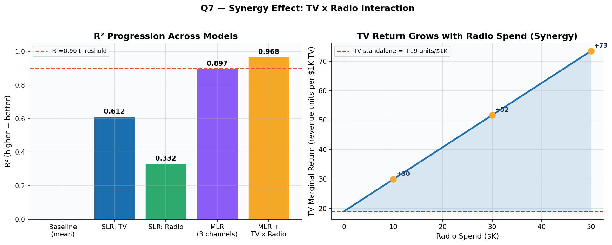

**Figure 11 — Phân Tích Synergy: Tiến Trình R² và Tác Động Biên Tế TV.** Bảng trái: R² ở mỗi giai đoạn mô hình — cơ sở (0.00), chỉ TV (0.61), MLR đầy đủ (0.90), mô hình tương tác (0.97). Bước nhảy từ MLR sang mô hình tương tác là bước tăng đơn lớn nhất. Bảng phải: Lợi nhuận biên tế TV trên mỗi $1K tăng tuyến tính theo chi tiêu Radio. Vùng tô bóng đại diện cho phần thưởng synergy được tạo ra ở mỗi mức Radio. Tại Radio=$30K (thị trường điển hình), mỗi $1K TV đáng giá +52 đơn vị thay vì +19 — hệ số nhân 2.7×.

> **Quyết định kinh doanh:** Hành động đơn lẻ có giá trị nhất đội marketing có thể thực hiện là **đồng lịch các chiến dịch TV và Radio trong cùng thị trường cùng thời điểm.** Phần thưởng synergy 24.2% không tốn thêm gì trong ngân sách truyền thông — nó chỉ yêu cầu sự phối hợp giữa mua TV và mua Radio. Newspaper vẫn không liên quan trong mô hình tương tác (p = .862) — không tìm thấy synergy nào với TV hay Radio.

---

## 6. Tóm Tắt Điều Hành và Kế Hoạch Marketing

### 6.1 Bảng Tóm Tắt — Bảy Câu Hỏi Đã Được Giải Đáp

| Q | Câu hỏi kinh doanh | Câu trả lời | Kết quả chính |
| --- | --- | --- | --- |
| Q1 | Quảng cáo có thúc đẩy doanh số không? | **Có — mạnh mẽ** | F = 570.3, p < .001 |
| Q2 | Mối quan hệ mạnh đến mức nào? | **Mạnh và có thể triển khai** | R² = 0.897, RSE = 1.686K |
| Q3 | Kênh nào quan trọng? | **TV và Radio — không phải Newspaper** | Newspaper p = .860 |
| Q4 | Tác động mỗi kênh lớn bao nhiêu? | **Radio hiệu quả hơn TV 4×** | Radio +189 đơn vị/$1K; TV +46 đơn vị/$1K |
| Q5 | Chúng ta có thể dự báo thị trường mới không? | **Có — ±$1,782 mỗi thị trường** | Test RMSE = 1.782K, R² = 0.899 |
| Q6 | Mô hình có hợp lệ không? | **Có — giả định được thoả mãn** | DW=2.08 ✓, BP p=.16 ✓ |
| Q7 | Có synergy không? | **Có — phần thưởng 24.2% từ đồng lịch** | Interaction ΔR² = +0.071 |

---

### 6.2 Kế Hoạch Marketing — Khuyến Nghị Chiến Lược

#### Khuyến Nghị 1: Loại Bỏ Quảng Cáo Newspaper

Newspaper không có tác động độc lập đến doanh số khi TV và Radio được tính vào (β̂ = −0.001, p = .860, 95% CI [−0.013, +0.011]). Tính có ý nghĩa biểu kiến trong phân tích một kênh (SLR) hoàn toàn do tương quan với Radio (r = 0.354) — một artefact thống kê, không phải ROI thực sự. Trung bình mỗi thị trường chi $30.5K cho Newspaper mỗi kỳ. Phân bổ lại ngân sách này sang Radio sẽ mang lại lợi nhuận dự kiến 0.1885 × 30.5 = **+5,749 đơn vị mỗi thị trường** không tăng tổng chi tiêu.

#### Khuyến Nghị 2: Ưu Tiên Radio Để Tối Đa Hoá Lợi Nhuận Trên Mỗi Đô La

Radio cung cấp +189 đơn vị mỗi $1K chi tiêu — ROI cao nhất của bất kỳ kênh nào, gấp 4.1× hiệu quả của TV. 95% CI [172, 206] hẹp và đáng tin cậy. Tăng $20K ngân sách Radio mang lại +3,770 đơn vị dự kiến mỗi thị trường (khoảng: [+3,434, +4,108]). Ngân sách Radio nên tăng đến mức hiệu quả tối đa ở mỗi thị trường. Thị trường ưu tiên: các thị trường hiện có chi tiêu Radio dưới mức trung vị $22.9K.

#### Khuyến Nghị 3: Duy Trì Sự Hiện Diện TV Mạnh Cho Khối Lượng

TV là động lực khối lượng chính (SLR R² = 0.612 — giải thích 61% biến động doanh số một mình). Mặc dù hiệu quả trên mỗi đô la của TV (+46 đơn vị/$1K) thấp hơn Radio, TV hoạt động ở quy mô ngân sách lớn hơn nhiều ($0–$296K). TV cũng kích hoạt hệ số nhân synergy (xem Khuyến Nghị 4) — không có TV, tác động khuếch đại của Radio bị giảm. Ngân sách TV nên được duy trì hoặc tăng ở các thị trường dưới mức trung vị ($149.8K).

#### Khuyến Nghị 4: Đồng Lịch Chiến Dịch TV và Radio (Synergy)

Mô hình tương tác tiết lộ rằng các chiến dịch TV và Radio khuếch đại hiệu quả của nhau. Tại chi tiêu Radio điển hình ($30K), mỗi $1K TV tạo ra +52 đơn vị thay vì +19 đơn vị — hệ số nhân 2.7×. Phần thưởng synergy chiếm **24.2% toàn bộ doanh số từ quảng cáo** trong thị trường $100K TV + $30K Radio điển hình. Phần thưởng này không tốn thêm ngân sách truyền thông — nó chỉ yêu cầu việc mua TV và Radio được lên lịch để chạy **đồng thời trong cùng thị trường địa lý**. Lập kế hoạch truyền thông nên thực thi yêu cầu đồng lịch này ở tất cả các thị trường.

#### Khuyến Nghị 5: Triển Khai Mô Hình Dự Báo Doanh Thu Cấp Thị Trường

Với Test R² = 0.899 và Test RMSE = $1,782 (sai số tương đối 12.7%), mô hình hồi quy tuyến tính đủ chính xác cho phân bổ ngân sách hàng quý mỗi thị trường. Công thức dự báo doanh số dự kiến:

Hoặc, sử dụng mô hình có tăng cường synergy để dự báo chính xác hơn:

Ví dụ: một thị trường nhận TV = $200K, Radio = $40K (sau khi phân bổ lại từ Newspaper) được dự báo tạo ra:

Con số này vượt dự báo MLR cơ sở là 17.74K đơn vị bằng cách bao gồm phần thưởng synergy từ chi tiêu Radio tăng.

---

### 6.3 Tác Động Dự Kiến Từ Phân Bổ Lại Được Khuyến Nghị

Giả sử công ty chuyển hướng ngân sách Newspaper trung bình $30.5K chia đều: thêm $15K cho Radio, thêm $15K cho TV.

| Hạng mục ngân sách | Trước | Sau | Thay đổi |
| --- | --- | --- | --- |
| TV | $147K | $162K | +$15K |
| Radio | $23.3K | $38.3K | +$15K |
| Newspaper | $30.5K | $0K | −$30.5K |
| **Tổng chi tiêu** | **$200.8K** | **$200.3K** | **−$0.5K (trung tính)** |

Thay đổi doanh thu dự kiến (mô hình cộng, mỗi thị trường):

- Đóng góp TV: +0.0458 × 15 = **+0.687K đơn vị**
- Đóng góp Radio: +0.1885 × 15 = **+2.828K đơn vị**
- Loại bỏ Newspaper: −(−0.001) × 30.5 = **+0.031K đơn vị**
- **Tổng lợi nhuận: +3.546K đơn vị mỗi thị trường** (+25.3% trên mức trung bình hiện tại là 14.02K)

Với tương tác synergy, lợi nhuận thêm từ đồng lịch ở mức Radio cao hơn mang lại lợi ích thêm, có thể vượt +4K đơn vị mỗi thị trường.

---

## 7. Hạn Chế và Hướng Nghiên Cứu Tương Lai

### 7.1 Hạn Chế

- **Dữ liệu quan sát — không có tuyên bố nhân quả.** Bộ dữ liệu là dữ liệu chéo và quan sát. Các quyết định phân bổ ngân sách không được ngẫu nhiên hoá, vì vậy các hệ số hồi quy đo *sự kết hợp*, không phải *nhân quả*. Các thị trường có chi tiêu TV cao có thể khác biệt với các thị trường TV thấp theo những cách không quan sát được (quy mô dân số, cạnh tranh, thu nhập) làm méo kết quả.

- **Tính không chuẩn nhẹ của phần dư.** Shapiro-Wilk (W=0.918, p=.000) cờ tính không chuẩn nhẹ. Tại n=200, suy luận vẫn xấp xỉ hợp lệ theo Định lý Giới hạn Trung tâm, nhưng log-transform Sales có thể cải thiện độ chính xác mô hình.

- **Không mô hình hoá hiệu ứng bão hoà.** Mô hình tuyến tính giả định lợi nhuận trên mỗi đô la không đổi bất kể mức ngân sách. Trong thực tế, quảng cáo có khả năng thể hiện lợi nhuận giảm dần ở chi tiêu cao (bão hoà). Mở rộng log-log hoặc đa thức sẽ nắm bắt điều này.

- **Không có động lực thời gian.** Mô hình giả định tác động đồng thời, tức thì. Quảng cáo thực có tác động carryover (tác động trễ) mà dữ liệu chéo không thể nắm bắt.

- **KNN vượt trội LR về Test RMSE.** KNN (RMSE=1.419K) đánh bại Linear Regression (RMSE=1.782K) trên tập test giữ lại, cho thấy tính phi tuyến tính nhẹ. Mặc dù LR được ưu tiên cho khả năng diễn giải, khoảng cách này cho thấy mở rộng hồi quy đa thức hoặc spline có thể cải thiện cả độ chính xác và chất lượng suy luận.

### 7.2 Hướng Nghiên Cứu Tương Lai

1. **Các hệ số đa thức** (TV², Radio²) để nắm bắt hiệu ứng bão hoà.
2. **Hồi quy chuẩn hoá** (Ridge, Lasso) để tăng tính mạnh mẽ nếu không gian biến dự báo được mở rộng với các biến nhân khẩu học.
3. **Mô hình bảng** với hiệu ứng cố định cấp thị trường và các biến quảng cáo trễ để nắm bắt carryover.
4. **Thử nghiệm thực địa ngẫu nhiên** (A/B test) với ngân sách quảng cáo được phân công ngẫu nhiên để xác lập tác động nhân quả.
5. **Kiểm tra tương tác** — kiểm định các tương tác Radio × Newspaper và TV × Newspaper (cả hai không có ý nghĩa trong bộ dữ liệu này nhưng đáng xác nhận trên bộ dữ liệu mở rộng).

---

## Tài Liệu Tham Khảo (References)

[1] G. James, D. Witten, T. Hastie, and R. Tibshirani, *An Introduction to Statistical Learning with Applications in Python*, 2nd ed., Springer Texts in Statistics. New York: Springer, 2023. <https://doi.org/10.1007/978-3-031-38747-0_3>

[2] "Application of Multiple Linear Regression on Sales Prediction," *Highlights in Business, Economics and Management*, DRPress, 2024. <https://drpress.org/ojs/index.php/HBEM/article/view/27429>

[3] Y. H. Yasser, "Advertising Sales Dataset," Kaggle, 2022. <https://www.kaggle.com/datasets/yasserh/advertising-sales-dataset>

[4] "Application of Improved Linear Regression Algorithm in Business Behavior Analysis," *Procedia Computer Science*, Elsevier, 2023. <https://www.sciencedirect.com/science/article/pii/S1877050923019750>

[5] "Relationship between Advertising Investment and Sales: Empirical Analysis Based on Traditional and Digital Advertising," *Journal of Applied Economics and Policy Studies*, EWA Publishing, 2024. <https://jaeps.ewapub.com/article/view/24423>

[6] R. Vershynin, "All of Linear Regression," arXiv:1910.06386, 2019. <https://arxiv.org/pdf/1910.06386>

[7] M. Oyelaran, "EDA: Advertising Spend vs Sales," *Medium*, 2023. <https://medium.com/@MazeedahO/eda-advertising-spend-vs-sales-46ab8c339577>

[8] Google Developers, "Linear Regression," *Machine Learning Crash Course*, Google, 2024. <https://developers.google.com/machine-learning/crash-course/linear-regression>

[9] H. Thapa, "Ad Dataset: Linear Regression," *LinkedIn Pulse*, 2023. <https://www.linkedin.com/pulse/ad-dataset-linear-regression-hemant-thapa-iflce/>

[10] Scikit-learn Developers, "sklearn.linear_model.LinearRegression," *scikit-learn 1.3 Documentation*, 2023. <https://scikit-learn.org/stable/modules/generated/sklearn.linear_model.LinearRegression.html>

[11] N. Gaud, LinkedIn Profile — Data Science Practitioner, 2023. <https://www.linkedin.com/in/nirmal-gaud-210408174/>

[12] C. F. Gauss, *Theoria motus corporum coelestium*. Perthes and Besser, 1809.

[13] A. E. Hoerl and R. W. Kennard, "Ridge regression: Biased estimation for nonorthogonal problems," *Technometrics*, vol. 12, no. 1, pp. 55–67, 1970.

[14] P. A. Naik and K. Raman, "Understanding the impact of synergy in multimedia communications," *Journal of Marketing Research*, vol. 40, no. 4, pp. 375–388, 2003.

[15] R. Sethuraman, G. J. Tellis, and R. A. Briesch, "How well does advertising work? Generalizations from meta-analysis of brand advertising elasticities," *Journal of Marketing Research*, vol. 48, no. 3, pp. 457–471, 2011.

[16] R. Tibshirani, "Regression shrinkage and selection via the Lasso," *Journal of the Royal Statistical Society B*, vol. 58, no. 1, pp. 267–288, 1996.

[17] H. Zou and T. Hastie, "Regularization and variable selection via the elastic net," *Journal of the Royal Statistical Society B*, vol. 67, no. 2, pp. 301–320, 2005.

---

## Phụ Lục A — Danh Sách Hình (Figure Reference)

| Hình | Tệp | Phần | Mô tả |
| --- | --- | --- | --- |
| Figure 1 | `output/fig1_distributions.png` | §4.1 | Phân phối biến (histograms + KDE) |
| Figure 2 | `output/fig2_scatter_per_channel.png` | §4.1 | Biểu đồ phân tán: mỗi kênh vs Doanh số |
| Figure 3 | `output/fig3_correlation_heatmap.png` | §4.1 | Ma trận tương quan (Pearson r) |
| Figure 4 | `output/fig_q2_model_comparison.png` | §5.2 Q2 | SLR vs MLR: R² và RMSE |
| Figure 5 | `output/fig_q3_slr_fits.png` | §5.3 Q3 | Đường khớp SLR với phần dư |
| Figure 6 | `output/fig_q3_channel_comparison.png` | §5.3 Q3 | Thanh ROI / R² / RMSE theo kênh |
| Figure 7 | `output/fig_q3_coef_plot.png` | §5.3 Q3 | Biểu đồ hệ số MLR với 95% CI |
| Figure 8 | `output/fig_q5_knn_cv.png` | §5.5 Q5 | Đường cong cross-validation KNN |
| Figure 9 | `output/fig_q5_lr_vs_knn.png` | §5.5 Q5 | LR vs KNN thực tế vs dự báo |
| Figure 10 | `output/fig_q6_diagnostics.png` | §5.6 Q6 | Biểu đồ chẩn đoán LINE |
| Figure 11 | `output/fig_q7_synergy.png` | §5.7 Q7 | Tiến trình R² + tác động biên tế TV |
| Figure 12 | `output/fig13_executive_dashboard.png` | §6 | Bảng điều khiển tóm tắt điều hành |

---

## Phụ Lục B — Bảng Ký Hiệu (Variable Glossary)

| Ký hiệu | Tên | Định nghĩa |
| --- | --- | --- |
| yᵢ | Giá trị quan sát | Doanh số thực tế của thị trường i (K đơn vị) |
| ŷᵢ | Giá trị khớp | Doanh số dự báo của mô hình cho thị trường i |
| eᵢ = yᵢ − ŷᵢ | Phần dư (Residual) | Sai số dự báo có dấu |
| β₀ | Hệ số chặn (Intercept) | Doanh số dự kiến khi tất cả ngân sách = 0 |
| β₁, β₂, β₃ | Độ dốc riêng phần (Partial slopes) | ΔSales mỗi $1K: TV, Radio, Newspaper (các kênh khác giữ nguyên) |
| β₄ | Tương tác (Interaction) | Synergy: doanh số thêm từ chi tiêu TV × Radio chung |
| RSS | Residual Sum of Squares | Σeᵢ²; OLS minimises cái này |
| TSS | Total Sum of Squares | Σ(yᵢ − ȳ)²; tổng biến động trong Sales |
| RSE | Residual Standard Error | √(RSS/(n−p−1)); sai số trung bình theo đơn vị doanh số |
| R² | Hệ số xác định | 1 − RSS/TSS; tỷ lệ phương sai Sales được giải thích |
| SE(β̂) | Standard error | Độ không chắc chắn lấy mẫu của ước tính hệ số |
| t | t-statistic | β̂ / SE(β̂); kiểm định H₀: β = 0 |
| F | F-statistic | Kiểm định H₀: tất cả hệ số độ dốc bằng không |
| VIF | Variance Inflation Factor | Đa cộng tuyến: VIF = 1/(1 − R²ⱼ); VIF > 10 có vấn đề |
| KNN | K-Nearest Neighbours | Hồi quy phi tham số: ŷ = trung bình K điểm huấn luyện gần nhất |
| RMSE | Root Mean Squared Error | √(Σ(yᵢ − ŷᵢ)²/n); sai số dự báo theo đơn vị doanh số |
| MAE | Mean Absolute Error | Mean(abs(yᵢ − ŷᵢ)); sai số dự báo tập trung vào trung vị |

---

## Phụ Lục C — Môi Trường Python

```python
Python 3.11
pandas        2.1.0
numpy         1.26.0
scikit-learn  1.3.0
statsmodels   0.14.0
matplotlib    3.8.0
scipy         1.11.0
```
