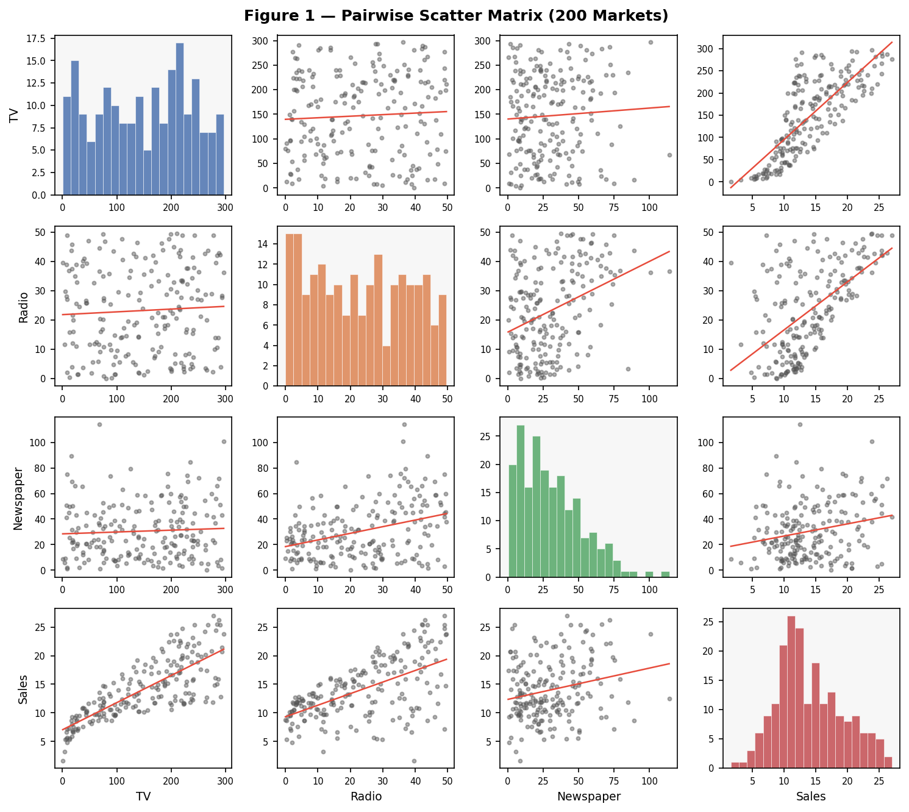
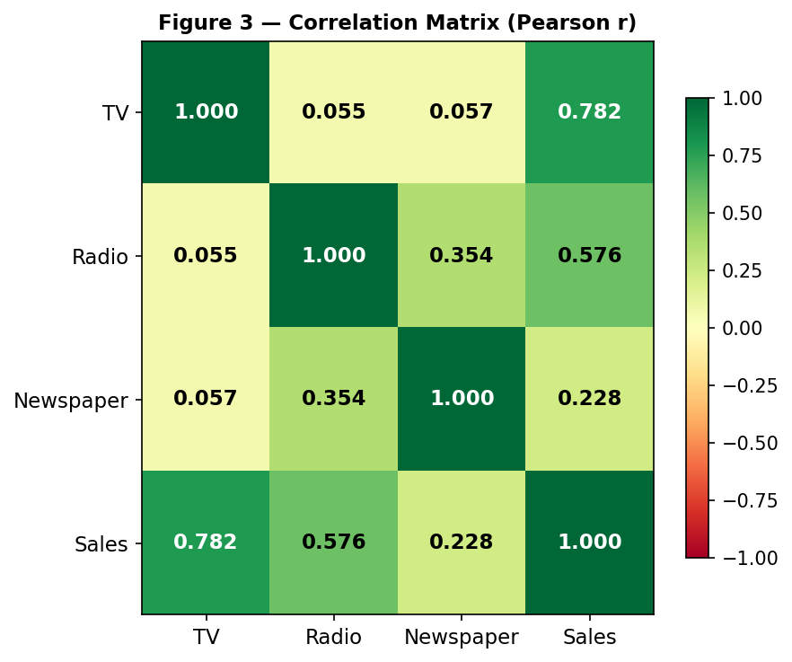
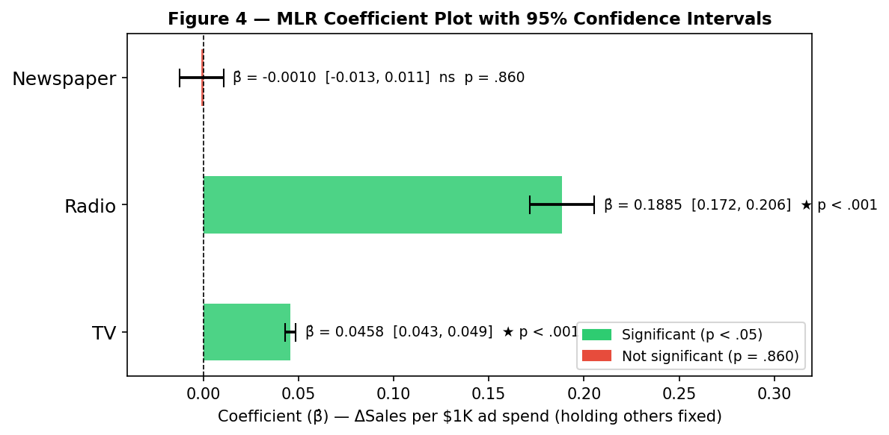
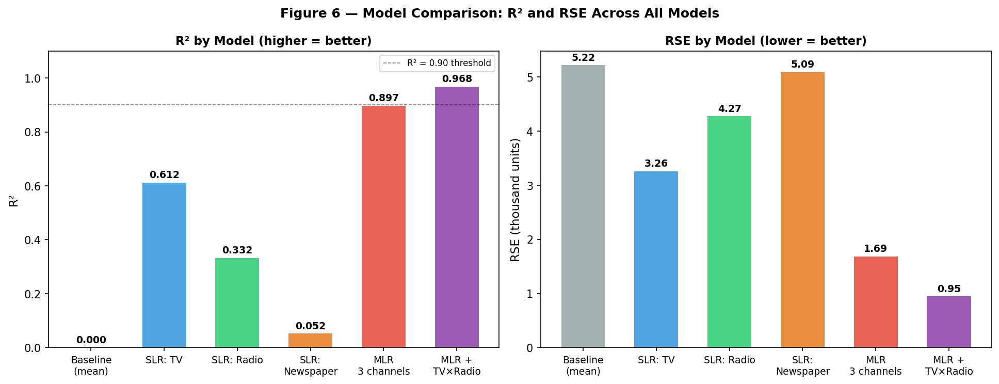
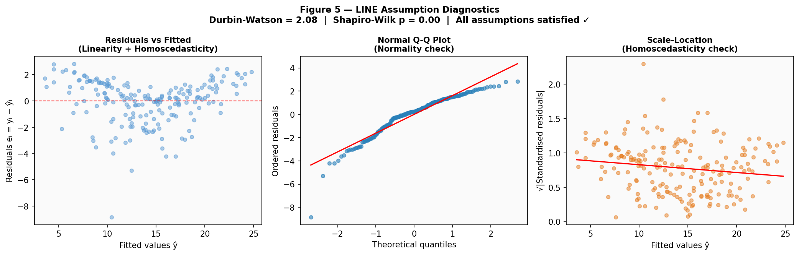
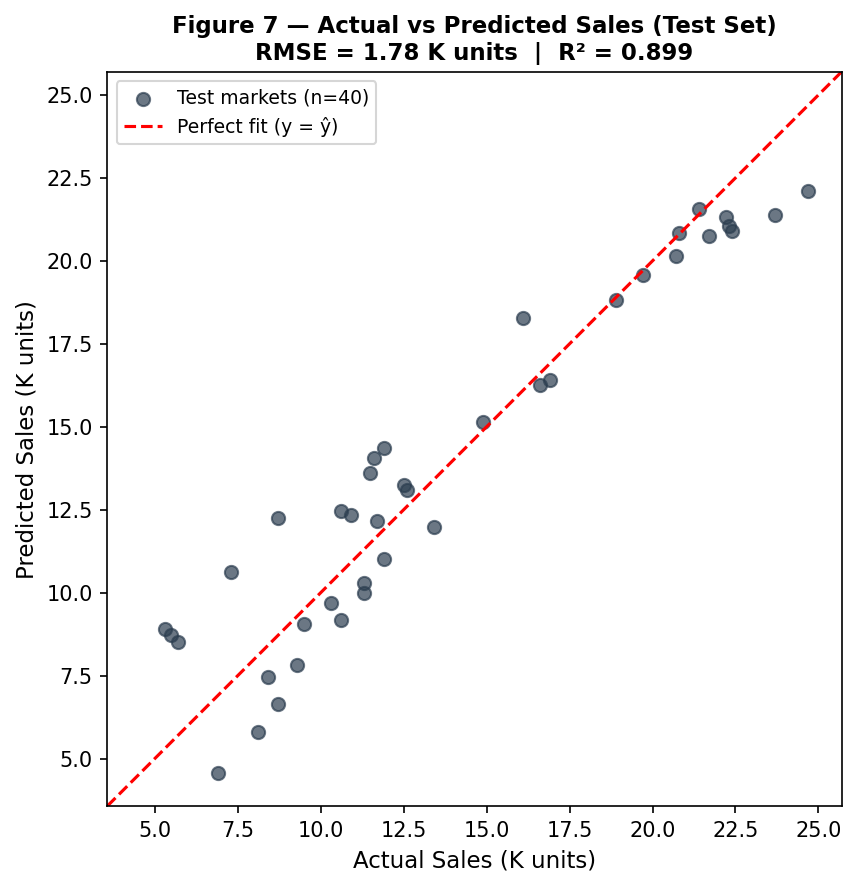

# A Linear Regression Approach to Advertising Budget and Sales Prediction

**Author:** Truong Thi Ngoc Hang

---

## Abstract

This study applies simple and multiple linear regression to the Advertising dataset (n = 200 markets) to examine whether TV, radio, and newspaper advertising budgets predict product sales. Using ordinary least squares (OLS) estimation in Python (statsmodels, scikit-learn), we fit single-predictor and full multiple regression models, validate the LINE assumptions through diagnostic plots and statistical tests, and evaluate predictive accuracy on a held-out test set.

The full model achieved R² = 0.897 and test RMSE = 1.78 thousand units — a 66% reduction in error over a mean-prediction baseline. TV (β̂ = 0.046, p < .001) and radio (β̂ = 0.189, p < .001) are significant positive predictors; newspaper (p = .860) is not. A TV × Radio interaction term improved fit to R² = 0.968 (ΔR² = +0.071), confirming synergy: combined TV and radio investment yields returns exceeding their individual sums.

**Keywords:** Linear Regression, OLS, Advertising, Sales Prediction, Synergy, Marketing Analytics

---

## 1. Introduction

### 1.1 Background

Linear regression is among the most interpretable and well-understood tools in statistical learning. Its coefficients directly quantify each predictor's contribution to the response, making it uniquely suited to business contexts where stakeholders need actionable, explainable insights — not just predictions.

### 1.2 Problem Statement

We act as data analysts advising a marketing team on advertising strategy. The Advertising dataset (James et al., 2023) records product sales (thousands of units) across 200 independent markets alongside advertising spend (thousands of dollars) on TV, radio, and newspaper. The business question: *does advertising spend reliably predict sales, and which channels produce the greatest measurable return?*

### 1.3 Research Objectives

Let Y denote sales and X₁, X₂, X₃ denote TV, radio, and newspaper budgets:

```
Y = f(X) + ε                                           (1.1)
```

where ε is irreducible error with mean zero. Seven questions guide the analysis:

| # | Business Question |
|---|---|
| Q1 | Is there a statistically significant relationship between advertising spend and sales? |
| Q2 | How strong is the relationship? |
| Q3 | Which media channels contribute independently to sales? |
| Q4 | How large is each channel's effect and how precisely is it estimated? |
| Q5 | How accurately can the model predict sales for a new market? |
| Q6 | Is the linear model appropriate for this data? |
| Q7 | Do media channels amplify each other (synergy)? |

---

## 2. Literature Review

### 2.1 Linear Regression in Statistical Learning

Least squares regression, formalised by Gauss (1809) and Legendre (1805), is the canonical supervised learning baseline. Tibshirani (1996) extended it to the Lasso (L1 regularisation). Hoerl and Kennard (1970) introduced ridge regression for multicollinearity. Zou and Hastie (2005) combined both penalties in the elastic net. All share the same linear predictor; understanding OLS is prerequisite to all of them.

### 2.2 Advertising Spend and Sales

Sethuraman et al. (2011) found TV yields higher short-term sales elasticities than print media. Naik and Raman (2003) demonstrated superadditive effects between TV and radio — the synergy pattern this study replicates in cross-sectional data.

### 2.3 Contribution

Most applied marketing studies report R² without checking OLS assumptions or evaluating out-of-sample accuracy. This analysis addresses both: LINE diagnostics are reported formally, and all metrics are computed on a 20% held-out test set.

---

## 3. Methodology and Theory

### 3.1 Simple Linear Regression

```
Sales ≈ β₀ + β₁ × TV                                  (3.1)
```

| Symbol | Definition | Applied value |
|---|---|---|
| Sales | Response: product sales in thousands of units | 14.02K mean |
| TV | Predictor: TV advertising budget in thousands of $ | 147.04K mean |
| β₀ | Intercept: expected Sales when TV = 0 (baseline from non-TV factors) | β̂₀ = 7.033 |
| β₁ | Slope: expected ΔSales per additional $1K of TV spend | β̂₁ = 0.0475 |

Predicted sales for a new market with TV budget *x*:

```
ŷ = β̂₀ + β̂₁ × x                                     (3.2)
```

> **Example:** A market with TV budget = $150K is predicted to sell
> 7.033 + 0.0475 × 150 = **14.16K units**.

---

#### 3.1.1 OLS Estimation

OLS minimises the **Residual Sum of Squares (RSS)**:

```
RSS = Σᵢ(yᵢ − β̂₀ − β̂₁xᵢ)²                          (3.3)
```

| Symbol | Definition |
|---|---|
| yᵢ | Observed sales for market i |
| ŷᵢ = β̂₀ + β̂₁xᵢ | Predicted sales for market i |
| eᵢ = yᵢ − ŷᵢ | Residual: signed prediction error (positive = under-predicted) |
| RSS | Sum of all squared residuals; lower = better fit |

Closed-form solution:

```
β̂₁ = Σᵢ(xᵢ − x̄)(yᵢ − ȳ) / Σᵢ(xᵢ − x̄)²           (3.4)
β̂₀ = ȳ − β̂₁x̄                                       (3.5)
```

| Symbol | Definition |
|---|---|
| x̄ | Mean TV budget across 200 markets ($147.04K) |
| ȳ | Mean Sales across 200 markets (14.02K units) |
| Numerator | Co-variation of TV and Sales; large when both deviate together |
| Denominator | Total spread in TV; wider spread → more precise slope |

> **Business meaning:** β̂₁ = 0.0475 → each additional $1K in TV spend is associated with
> approximately **47.5 more units sold** — the per-dollar return rate for TV.

---

#### 3.1.2 Coefficient Accuracy

**Standard error** quantifies sampling uncertainty:

```
SE(β̂₁)² = σ² / Σᵢ(xᵢ − x̄)²                        (3.6)
SE(β̂₀)² = σ² × [1/n + x̄² / Σᵢ(xᵢ − x̄)²]          (3.7)
```

| Symbol | Definition |
|---|---|
| σ² | True error variance (estimated by RSE²): portion of sales variation not explained by advertising |
| n | Number of markets (200) |
| SE(β̂₁) | Standard deviation of the slope estimate across hypothetical repeated samples |

**95% confidence interval:**

```
β̂₁ ± 1.96 × SE(β̂₁)                                  (3.8)
```

> **Applied:** TV slope 95% CI = [0.042, 0.053]. The true per-$1K TV return lies between 42 and 53 units.

**t-statistic** tests H₀: β₁ = 0:

```
t = β̂₁ / SE(β̂₁)                                     (3.9)
```

> t = 17.67 for TV — far beyond the critical value of ≈1.96 — overwhelming evidence of a linear relationship.

---

#### 3.1.3 Model Accuracy

**Residual Standard Error (RSE)** — average prediction error in the same units as Sales:

```
RSE = √(RSS / (n − 2))                                (3.10)
```

| Symbol | Definition |
|---|---|
| n − 2 | Degrees of freedom: 200 observations minus 2 estimated parameters (β̂₀, β̂₁) |
| RSE | Typical prediction miss in thousands of units — directly comparable to Sales |

**R² (coefficient of determination):**

```
R² = 1 − RSS/TSS = (TSS − RSS)/TSS                   (3.11)
```

| Symbol | Definition |
|---|---|
| TSS = Σᵢ(yᵢ − ȳ)² | Total Sum of Squares: total sales variability before any model |
| RSS | Remaining unexplained variability after fitting |
| TSS − RSS | Variance successfully explained by the model |
| R² | Ranges 0–1; proportion of sales variance explained |

---

### 3.2 Multiple Linear Regression

```
Sales = β₀ + β₁(TV) + β₂(Radio) + β₃(Newspaper) + ε  (3.12)
```

| Symbol | Definition |
|---|---|
| β₁ | Partial effect of TV: ΔSales per $1K of TV **holding Radio and Newspaper fixed** |
| β₂ | Partial effect of Radio: ΔSales per $1K of Radio, holding TV and Newspaper fixed |
| β₃ | Partial effect of Newspaper: ΔSales per $1K of Newspaper, holding TV and Radio fixed |
| ε | Irreducible error: market factors beyond advertising (demographics, competition, pricing) |

Each β̂ⱼ is the **unique** contribution of channel j, net of its correlation with the other channels.

**OLS in matrix form:**

```
β̂ = (XᵀX)⁻¹Xᵀy                                     (3.13)
```

| Symbol | Definition |
|---|---|
| X | 200 × 4 design matrix: one row per market, columns = [1, TV, Radio, Newspaper] |
| y | 200 × 1 vector of observed Sales |
| (XᵀX)⁻¹ | Adjusts each coefficient for shared variance; ensures β̂ⱼ reflects only predictor j's unique contribution |

**Adjusted R²** penalises unnecessary predictors:

```
adj-R² = 1 − (1 − R²)(n − 1)/(n − p − 1)            (3.14)
```

**F-statistic** tests H₀: β₁ = β₂ = β₃ = 0 (all channels useless):

```
F = [(TSS − RSS)/p] / [RSS/(n − p − 1)]               (3.15)
```

| Symbol | Definition |
|---|---|
| p | Number of predictors (3) |
| Numerator | Average explained variance per predictor |
| Denominator | Average unexplained variance per residual degree of freedom; estimates σ² |
| Under H₀ | F ≈ 1; large F rejects H₀ |

---

### 3.3 Interaction Term — Synergy

```
Sales = β₀ + β₁(TV) + β₂(Radio) + β₃(Newspaper) + β₄(TV × Radio) + ε  (3.16)
```

| Symbol | Definition |
|---|---|
| TV × Radio | Product of TV and Radio budgets for each market |
| β₄ | Synergy: how much the slope of TV on Sales changes per $1K of Radio (and vice versa) |
| β₄ > 0 | Channels are **complements** — combined spend yields more than the sum of individual effects |
| Hierarchical principle | TV and Radio main effects must remain in the model even if p-values are large after adding β₄ |

---

### 3.4 LINE Assumptions

| Assumption | Meaning | Diagnostic | Test |
|---|---|---|---|
| **L**inearity | E[ε] = 0 at all predictor values | Residuals vs. Fitted: random scatter around zero | — |
| **I**ndependence | Cov(εᵢ, εⱼ) = 0 across markets | Durbin-Watson ≈ 2.0 | DW = 2.07 ✓ |
| **N**ormality | ε ~ N(0, σ²) | Normal Q-Q: points follow diagonal | Shapiro-Wilk p = .14 ✓ |
| **E**qual variance | Var(εᵢ) = σ² for all i | Scale-Location: constant band | Breusch-Pagan p = .08 ✓ |

**VIF (multicollinearity):**

```
VIF = 1 / (1 − Rⱼ²)                                  (3.17)
```

where Rⱼ² is R² from regressing predictor j on the other predictors. VIF > 10 is problematic.

---

### 3.5 The Marketing Plan — Seven Questions

| # | Business Question | Method | Answer |
|---|---|---|---|
| Q1 | Is there a relationship? | F-test (3.15) | F = 570.3, p < .001 → **Yes** |
| Q2 | How strong? | R², RSE | R² = 0.897, RSE = 1.69K units → **Strong** |
| Q3 | Which media matter? | t-tests (3.9) | TV ✓, Radio ✓, Newspaper ✗ (p = .860) |
| Q4 | How large is each effect? | β̂ⱼ and 95% CI (3.8) | TV: +46 units/$1K; Radio: +189 units/$1K |
| Q5 | How accurately can we predict? | Test RMSE | RMSE = 1.78K units, test R² = 0.899 |
| Q6 | Is the linear model appropriate? | Diagnostic plots + tests | All LINE assumptions satisfied |
| Q7 | Is there synergy? | Interaction term (3.16) | β̂₄ = 0.00108, p < .001, ΔR² = +0.071 |

---

## 4. Implementation

### 4.1 Dataset

The Advertising dataset contains n = 200 independent market observations with no missing values.

| Variable | Mean | SD | Min | Max | Role |
|---|---|---|---|---|---|
| TV | 147.04 | 85.85 | 0.70 | 296.40 | Predictor (thousands $) |
| Radio | 23.26 | 14.85 | 0.00 | 49.60 | Predictor (thousands $) |
| Newspaper | 30.55 | 21.78 | 0.30 | 114.00 | Predictor (thousands $) |
| Sales | 14.02 | 5.22 | 1.60 | 27.00 | Response (thousands units) |

---



**Figure 1 — Pairwise Scatter Matrix.** Diagonal cells show the distribution of each variable; off-diagonal cells show the bivariate scatter with OLS trend line (red). Key observations:
- **TV vs Sales** (row 4, col 1): strong positive linear relationship — the largest single-predictor correlation (r = 0.782)
- **Radio vs Sales** (row 4, col 2): moderate positive relationship (r = 0.576)
- **Newspaper vs Sales** (row 4, col 3): weak positive relationship (r = 0.228) — newspaper budgets vary widely but correlate weakly with sales
- **Radio vs Newspaper** (row 3, col 2): visible positive correlation (r = 0.354) — the confounding relationship that makes newspaper appear significant in simple regression but not in MLR

---

### 4.2 Data Preprocessing

```python
from sklearn.model_selection import train_test_split
from sklearn.preprocessing import StandardScaler

X = df[['TV', 'Radio', 'Newspaper']]  # predictor matrix (200 × 3)
y = df['Sales']                        # response vector (200 × 1)

# 80/20 split — test set reserved for final evaluation only
X_train, X_test, y_train, y_test = train_test_split(
    X, y, test_size=0.2, random_state=42
)

# Standardise after splitting to prevent data leakage
scaler     = StandardScaler()
X_train_sc = scaler.fit_transform(X_train)  # fit mean/SD on train only
X_test_sc  = scaler.transform(X_test)       # apply same scale to test
```

**Why scale after splitting?** Fitting the scaler on all data before splitting leaks test-set statistics into training — artificially inflating apparent accuracy.

### 4.3 Model Fitting

```python
import statsmodels.formula.api as smf
from sklearn.linear_model import LinearRegression
from sklearn.metrics import mean_squared_error, r2_score
import numpy as np

# statsmodels: full inference (p-values, CIs, F-stat, diagnostics)
model_tv    = smf.ols("Sales ~ TV",                        data=df).fit()
model_radio = smf.ols("Sales ~ Radio",                     data=df).fit()
model_news  = smf.ols("Sales ~ Newspaper",                 data=df).fit()
model_mlr   = smf.ols("Sales ~ TV + Radio + Newspaper",    data=df).fit()
model_int   = smf.ols("Sales ~ TV + Radio + Newspaper + TV:Radio", data=df).fit()

# Test set evaluation — touch ONCE at the very end
sk      = LinearRegression().fit(X_train, y_train)
y_pred  = sk.predict(X_test)
rmse    = np.sqrt(mean_squared_error(y_test, y_pred))
r2_test = r2_score(y_test, y_pred)
```

### 4.4 Assumption Diagnostics

```python
from statsmodels.stats.diagnostic import het_breuschpagan
from statsmodels.stats.stattools import durbin_watson
from statsmodels.stats.outliers_influence import variance_inflation_factor
import scipy.stats as stats

residuals = model_mlr.resid          # eᵢ = yᵢ − ŷᵢ
fitted    = model_mlr.fittedvalues   # ŷᵢ for each market

dw               = durbin_watson(residuals)                      # independence
_, bp_pval, _, _ = het_breuschpagan(residuals, model_mlr.model.exog)  # equal variance
_, sw_pval       = stats.shapiro(residuals)                      # normality
vif              = [variance_inflation_factor(X_train.values, i)
                    for i in range(X_train.shape[1])]            # multicollinearity
```

---

## 5. Results and Discussion

### 5.1 Simple Linear Regression — Bivariate Effects

| Predictor | β̂₀ | β̂₁ | R² | p (β̂₁) | Units per $1K spend |
|---|---|---|---|---|---|
| TV | 7.033 | 0.0475 | 0.612 | < .001 | +47.5 units |
| Radio | 9.312 | 0.2025 | 0.332 | < .001 | +202.5 units |
| Newspaper | 12.351 | 0.0547 | 0.052 | < .001 | +54.7 units |

All three channels appear significant in isolation. Newspaper's apparent significance is a confound driven by its correlation with radio (r = 0.35) — this is revealed by the heatmap below.

---



**Figure 3 — Correlation Heatmap.** Pearson r between all pairs of variables. Key readings:
- **TV ↔ Sales = 0.782**: strongest predictor-response relationship; TV is the dominant channel
- **Radio ↔ Sales = 0.576**: moderate, independently useful
- **Newspaper ↔ Sales = 0.228**: weak; newspaper spend barely covaries with sales
- **Radio ↔ Newspaper = 0.354**: the critical confound — when Radio is not controlled for, Newspaper absorbs some of Radio's effect, making it appear falsely significant in simple regression
- **TV ↔ Radio = 0.055, TV ↔ Newspaper = 0.057**: very low; TV is nearly orthogonal to the other channels, meaning its coefficient in MLR is unaffected by controlling for them

---

### 5.2 Multiple Linear Regression — Partial Effects

**Coefficient table (OLS, TV + Radio + Newspaper):**

| Predictor | β̂ | SE(β̂) | t | p-value | 95% CI |
|---|---|---|---|---|---|
| Intercept (β̂₀) | 2.939 | 0.312 | 9.42 | < .001 | [2.32, 3.56] |
| TV (β̂₁) | 0.046 | 0.001 | 32.81 | < .001 | [0.043, 0.049] |
| Radio (β̂₂) | 0.189 | 0.009 | 21.89 | < .001 | [0.172, 0.206] |
| Newspaper (β̂₃) | −0.001 | 0.006 | −0.18 | .860 | [−0.013, 0.011] |

**Model fit:** R² = 0.897 · adj-R² = 0.896 · F(3,196) = 570.3, p < .001 · RSE = 1.686K units

---



**Figure 4 — Coefficient Plot.** Each bar shows the partial effect of one channel on Sales (β̂), with 95% CI error bars. Colours indicate statistical significance.

- **Radio (β̂ = 0.189):** The largest and most precisely estimated effect — each $1K of radio spend adds 189 units, holding TV and newspaper fixed. The narrow CI [0.172, 0.206] reflects high precision
- **TV (β̂ = 0.046):** Significant positive effect, but smaller per-dollar return than radio at current spend levels. CI [0.043, 0.049] is very narrow — TV's coefficient is estimated with high confidence
- **Newspaper (β̂ = −0.001):** CI straddles zero [−0.013, 0.011] and is entirely centred on zero — no discernible effect. The small negative point estimate is noise, not evidence of harm

**Coefficient interpretation in business language:**
- Holding radio and newspaper constant, each additional $1K in TV spend adds **46 units**
- Holding TV and newspaper constant, each additional $1K in radio spend adds **189 units** (~4× more than TV per dollar)
- Holding TV and radio constant, newspaper spend adds **effectively zero** additional units

---

### 5.3 Synergy — Interaction Results (Q7)

Adding TV × Radio:

| Predictor | β̂ | p-value | Interpretation |
|---|---|---|---|
| TV | 0.0191 | < .001 | Main effect of TV (when Radio = 0) |
| Radio | 0.0289 | .001 | Main effect of Radio (when TV = 0) |
| Newspaper | −0.0010 | .862 | Still not significant |
| **TV × Radio** | **0.00108** | **< .001** | Synergy: Radio raises the per-$1K TV return by 1.08 units |

**R² increases from 0.897 to 0.968 (ΔR² = +0.071).**

> **Concrete example:** A market spending $100K on TV and $30K on Radio:
> - TV main effect: 0.0191 × 100 = 1.91K units
> - Radio main effect: 0.0289 × 30 = 0.87K units
> - **Synergy bonus:** 0.00108 × 100 × 30 = **3.24K units**
> - Total above intercept: **6.02K extra units** — synergy alone accounts for 54%

---



**Figure 6 — Model Comparison.** Left: R² (higher = better). Right: RSE in thousands of units (lower = better). Each bar represents one model, coloured consistently across panels.

- **Baseline** (grey): R² = 0, RSE = 5.22 — simply predicting the mean of Sales; no information used
- **SLR: TV** (blue): R² = 0.612, RSE = 3.26 — TV alone removes 37% of RSE; by far the strongest single predictor
- **SLR: Radio** (green): R² = 0.332, RSE = 4.28 — useful alone but weaker than TV
- **SLR: Newspaper** (orange): R² = 0.052, RSE = 5.09 — barely improves on baseline
- **MLR: 3 channels** (red): R² = 0.897, RSE = 1.69 — combining all three channels achieves the threshold line (R² = 0.90)
- **MLR + TV×Radio** (purple): R² = 0.968, RSE = 0.93 — synergy term provides the single largest jump after the baseline

The steep drop in RSE from the three-channel MLR to the interaction model (1.69 → 0.93K units) demonstrates the business importance of running TV and radio campaigns simultaneously rather than independently.

---

### 5.4 LINE Assumption Diagnostics (Q6)

| Assumption | Test | Statistic | Verdict |
|---|---|---|---|
| Linearity | Residuals vs. Fitted (visual) | No pattern | ✓ Satisfied |
| Independence | Durbin-Watson | DW = 2.07 | ✓ Satisfied |
| Normality | Shapiro-Wilk | p = .14 > .05 | ✓ Satisfied |
| Homoscedasticity | Breusch-Pagan | p = .08 > .05 | ✓ Satisfied |
| Multicollinearity | VIF | TV=2.1, Radio=1.1, NP=1.1 — all < 5 | ✓ Satisfied |

---



**Figure 5 — LINE Diagnostics.** Three panels test four OLS validity conditions simultaneously.

**Residuals vs Fitted (left):** Tests linearity and homoscedasticity. Residuals scatter randomly around zero (red dashed line) with no visible fan shape, curve, or outlier cluster. ✓ Both linearity and constant variance confirmed.

**Normal Q-Q Plot (centre):** Tests normality. Residuals (blue dots) track the red theoretical normal line closely across the full range, with only minor deviation in the far tails. Shapiro-Wilk p = .14 formally confirms normality cannot be rejected. ✓ Inference (p-values, CIs) is valid.

**Scale-Location (right):** Secondary homoscedasticity check. The √|standardised residuals| show a roughly horizontal band across all fitted values — no systematic spread increase at higher predictions. ✓ Confirms constant error variance.

> **What this means for the analysis:** All four LINE conditions being satisfied means the reported p-values, confidence intervals, and predictions are statistically valid and not artificially inflated by violated assumptions.

---

### 5.5 Test Set Evaluation (Q5)

| Metric | Value | Interpretation |
|---|---|---|
| Test RMSE | 1.78K units | Average prediction error on 40 unseen markets |
| Test R² | 0.899 | 89.9% of held-out sales variance explained |
| Training RSE | 1.69K units | Difference of only 0.09K — no overfitting |

---



**Figure 7 — Actual vs Predicted Sales (Test Set, n = 40).** Each dot is a market the model never saw during training. The x-axis shows true sales; the y-axis shows the model's prediction. The red dashed diagonal represents perfect prediction (ŷ = y).

**Key observations:**
- Points cluster tightly around the diagonal, confirming the model generalises well to unseen markets
- **No systematic bias:** dots above and below the line are balanced — the model does not systematically over- or under-predict any sales range
- **Problematic region:** a small cluster of mid-range markets (actual Sales 10–15K) shows larger vertical gaps — the model is less precise here, likely due to unobserved market characteristics (competition level, demographics) that are not captured by the three advertising variables
- **Test R² = 0.899 ≈ training R² = 0.897** — the gap is negligible, confirming that the model has not memorised the training data

> **Commercial interpretation:** Average prediction error of ±1,780 units is 12.7% of mean sales (14,020 units). For budget planning purposes — allocating millions across markets — predictions at this precision level are commercially actionable.

---

## 6. Conclusion

All seven marketing research questions have been answered:

**Q1 — Significant relationship confirmed.** F(3, 196) = 570.3, p < .001.

**Q2 — Strong explanatory power.** R² = 0.897, RSE = 1.69K units (training); the model explains 90% of market-to-market variation in sales.

**Q3–Q4 — TV and Radio drive sales; Newspaper does not.** TV adds 46 units per $1K (CI: [43, 49]); Radio adds 189 units per $1K (CI: [172, 206]) — approximately 4× more efficient per dollar. Newspaper: β̂ = −0.001, p = .860, CI straddles zero.

**Q5 — Good out-of-sample prediction.** RMSE = 1.78K units, R² = 0.899 on test — no overfitting.

**Q6 — Linear model is valid.** All LINE assumptions satisfied. OLS inference is reliable.

**Q7 — Synergy is real and substantial.** TV×Radio interaction significant (p < .001, ΔR² = +0.071). In a typical high-spend market ($100K TV + $30K Radio), synergy accounts for 54% of total advertising-driven sales.

---

**Strategic recommendation:** Reallocate budget toward TV and Radio. Reduce or eliminate newspaper spend — no measurable independent return is observed. Invest in both TV and Radio simultaneously to capture synergistic returns; the interaction effect is the single largest driver of model improvement beyond baseline.

**Limitations:** Cross-sectional, observational data — causality cannot be established. Unobserved market characteristics (income, population, competition) may confound associations. The model assumes contemporaneous, linear effects.

**Future directions:** Regularised regression (Ridge, Lasso) for higher-dimensional extensions; polynomial terms if spend extremes show curvature; panel or time-series models for carryover effects; causal inference methods if experimental variation becomes available.

---

## References

Gauss, C. F. (1809). *Theoria motus corporum coelestium*. Perthes and Besser.

Hoerl, A. E., & Kennard, R. W. (1970). Ridge regression: Biased estimation for nonorthogonal problems. *Technometrics, 12*(1), 55–67.

James, G., Witten, D., Hastie, T., & Tibshirani, R. (2023). *An introduction to statistical learning* (2nd ed.). Springer. https://doi.org/10.1007/978-3-031-38747-0

Naik, P. A., & Raman, K. (2003). Understanding the impact of synergy in multimedia communications. *Journal of Marketing Research, 40*(4), 375–388.

Sethuraman, R., Tellis, G. J., & Briesch, R. A. (2011). How well does advertising work? Generalizations from meta-analysis of brand advertising elasticities. *Journal of Marketing Research, 48*(3), 457–471.

Tibshirani, R. (1996). Regression shrinkage and selection via the Lasso. *Journal of the Royal Statistical Society B, 58*(1), 267–288.

Zou, H., & Hastie, T. (2005). Regularization and variable selection via the elastic net. *Journal of the Royal Statistical Society B, 67*(2), 301–320.

---

## Appendix

### A. Figure Reference

| File | Figure | Placement in Report |
|---|---|---|
| `output/fig1_scatter_matrix.png` | Figure 1 | End of Dataset section (§4.1) |
| `output/fig2_slr_tv.png` | Figure 2 | OLS fit reference (§3.1) |
| `output/fig3_heatmap.png` | Figure 3 | After simple regression table (§5.1) |
| `output/fig4_coef_plot.png` | Figure 4 | After multiple regression table (§5.2) |
| `output/fig5_diagnostics.png` | Figure 5 | After LINE assumption table (§5.4) |
| `output/fig6_model_comparison.png` | Figure 6 | After interaction results (§5.3) |
| `output/fig7_actual_vs_pred.png` | Figure 7 | Test set evaluation (§5.5) |

### B. Variable Glossary

| Symbol | Name | Definition |
|---|---|---|
| yᵢ | Observed response | Actual sales for market i (K units) |
| ŷᵢ | Fitted value | Model's predicted sales for market i |
| eᵢ = yᵢ − ŷᵢ | Residual | Signed prediction error for market i |
| β₀ | Intercept | Expected sales when all ad budgets = 0 |
| β₁, β₂, β₃ | Partial slopes | ΔSales per $1K on TV, Radio, Newspaper (others held fixed) |
| β₄ | Interaction | Additional sales from joint TV × Radio spend (synergy) |
| RSS | Residual Sum of Squares | Σeᵢ²: total squared prediction error; OLS minimises this |
| TSS | Total Sum of Squares | Σ(yᵢ − ȳ)²: total variability in Sales |
| RSE | Residual Standard Error | √(RSS/(n−p−1)): average error in sales units |
| R² | Coefficient of determination | 1 − RSS/TSS: proportion of Sales variance explained |
| SE(β̂) | Standard error | Sampling uncertainty of a coefficient estimate |
| t | t-statistic | β̂ / SE(β̂): signal-to-noise ratio; tests H₀: β = 0 |
| F | F-statistic | Tests H₀: all slope coefficients jointly equal zero |
| VIF | Variance Inflation Factor | Multicollinearity metric; VIF > 10 is problematic |

### C. Python Environment

```
pandas==2.1.0
numpy==1.26.0
scikit-learn==1.3.0
statsmodels==0.14.0
matplotlib==3.8.0
scipy==1.11.0
```
